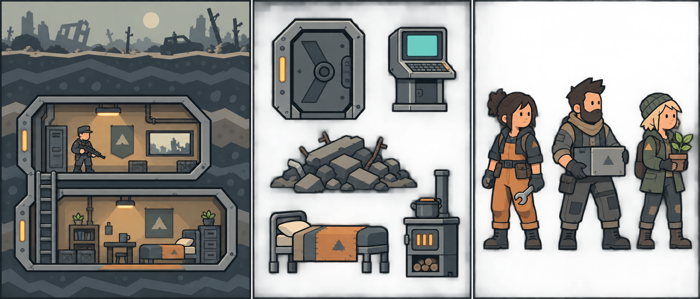
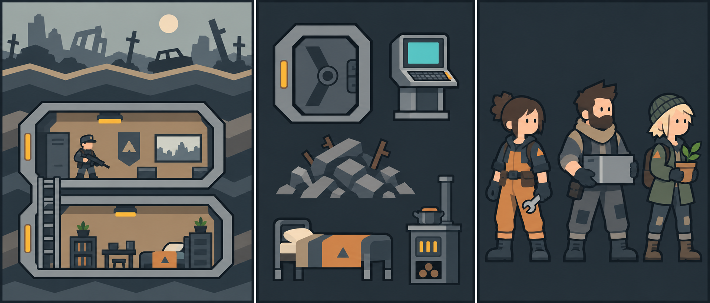
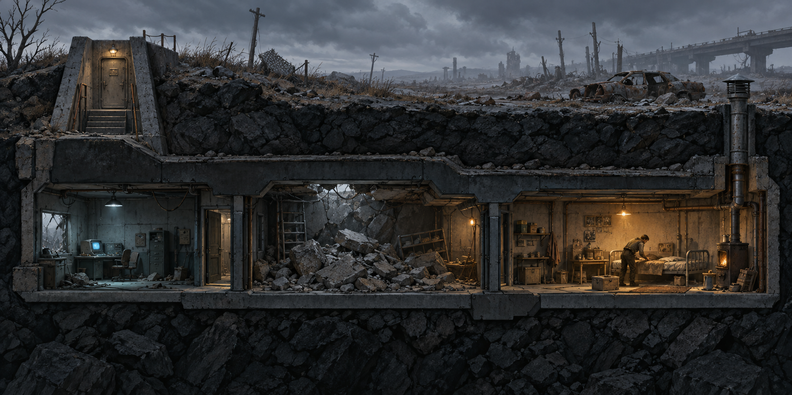
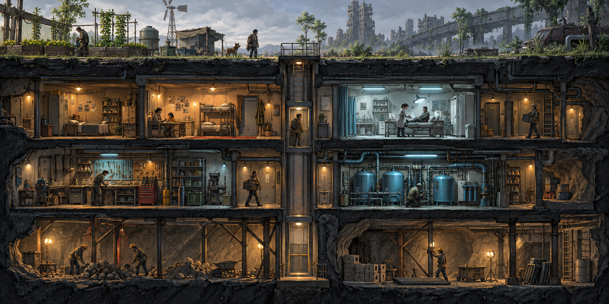
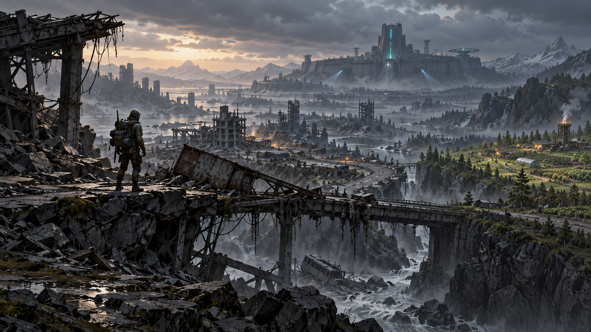
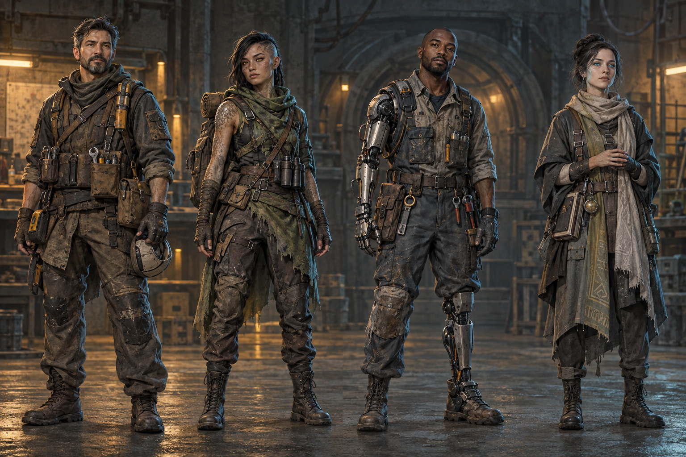

# Арт-концепция «Живого бункера»

**Текущее стилевое решение — «Слоистый свет»**, простая плоская графика с чёткими силуэтами. Ранние четыре изображения ниже служат только ориентирами для композиции, расположения комнат, сюжета и настроения: их реалистичную фактуру, освещение и пропорции персонажей в игру не переносим. Графические правила, палитра и интерфейс описаны в [визуальном направлении](Визуальный стиль и музыка.md); размеры и взаимодействия — в [первом игровом часе](Первый игровой час.md).

Положение входа, дороги, лестницы, лифта и нижних этажей определяет [пространственная схема мира](Пространственная схема мира.md). Если ранние концепты расходятся с ней, следуем схеме.

## Текущий стилевой лист

**Берём в работу:** два-три тона на объект, ясный тёмный контур, ступенчатые слои породы, скошенные металлические рамы, узкие янтарные лампы, простые лица и крупные признаки профессии. Это эскиз языка форм, а не точный игровой экран: размер комнат, лестницы, оборудование и маршруты будут проверены в макете по сетке.

### Упрощённый вариант

Здесь меньше деталей породы, мебели и одежды; большие цветовые плоскости делают комнаты и предметы яснее при уменьшении изображения. Оставляем оба листа для сравнения в игровом масштабе. Следующий шаг — проверить на реальном экране, хватает ли различий между профессиями и состояниями предметов без мелкой фактуры.

### Персонажи в упрощённом стиле

Этот обзор задаёт следующий уровень упрощения: десять вариантов в каждом из двенадцати рядов. Различия человеческих групп относятся к рисунку конкретных персонажей и не задают игровые свойства по происхождению. Силуэт мутантов меняют животные признаки, киборги полностью механические, псионики более хрупкие и крупноголовые. Подробности закреплены в [концепции персонажей](Персонажи.md).

Герой, мутант-разведчик, киборг-механик и псионик-исследователь выполнены в одном масштабе; нижний ряд помогает сравнить силуэты без цвета и деталей. Лист дополняет [концепцию персонажей](Персонажи.md). Образы служат началом системы модульной одежды и изменений тела, а не четырьмя неизменяемыми типами жителей.

### Панорама поверхности

Фон продолжает поверхность вправо: руины на нескольких планах, разрушенная дорога, редкая новая зелень и очень далёкий силуэт правительственного комплекса. Игровая земля, здания и жители накладываются поверх. Разделение на слои параллакса и точное положение горизонта проверяются вместе с [пространственной схемой](Пространственная схема мира.md).

Четыре сезонных состояния, ночь и погодные эффекты описаны в [системе панорам](Панорамы и погода.md).

## Ранние композиционные референсы

## 1. Первый вход

**Что берём:** горизонтальный разрез с поверхностью над ним, очень малый масштаб героя относительно среды, три легко различимые части первого бункера. Холодная охранная комната и завал постепенно переходят в тёплую обжитую зону. Игрок видит следы ремонта, кровать, вентиляцию и очаг прямо в мире.

**Как использовать:** это ориентир по свету, материалу и повествованию окружением. В игровом виде предметы нужно сделать крупнее и проще по силуэту, чтобы кровать, ящик, терминал и завал читались при обычном масштабе камеры.

## 2. Растущий бункер

**Что берём:** помещения узнаются по оборудованию, а не только по цвету или названию. Жильё тёплое, медицина холоднее и чище, мастерская плотнее и шумнее, инженерная комната заполнена трубами и ёмкостями. Вертикальные пути и начатая стройка видны в том же разрезе. На поверхности появляются признаки обрабатываемой земли.

**Как использовать:** ограничиваем визуальный шум. В проекте с большим числом комнат отдельная мелкая деталь должна уступать место читаемому назначению, путям, состоянию работы и выбранному объекту.

## 3. Пустошь и Ядро

**Что берём:** путь к центру мира ощущается как длинное путешествие через опасные участки. На переднем плане виден риск перехода через разрушенный пролёт, вдали — правительственный комплекс, справа — следы жизни и терраформинга. Ядро остаётся загадочной целью, а не обычной городской постройкой.

**Как использовать:** этот кадр задаёт иллюстративный язык карточек маршрута и событий. В первом выпуске игрок выбирает маршрут и решения по отчётам, не управляет фигурой на свободной глобальной карте. Открытость дальнего мира показываем через рисунки мест, погоду и сведения разведки.

## 4. Пути развития персонажей

**Что берём:** четыре направления эволюции остаются людьми со своей работой и историей. Отличия видны в силуэте и снаряжении: инструменты и одежда человека, биологические изменения мутанта, обслуживаемые механические части киборга, сдержанные признаки псионики. Ни одна ветка не выглядит автоматически «финальной» или лучшей.

**Как использовать:** в игровом масштабе оставляем один-два крупных узнаваемых признака на ветку, а мелкие детали раскрываем при приближении и в карточке персонажа. Появление импланта или мутации должно менять уже существующего персонажа, а не заменять его модель новым безличным типом.

## Общие правила, которые следуют из кадров

1. **Бункер рассказывает о времени.** Старая конструкция, новый ремонт и позднее оборудование сосуществуют в одной комнате.
2. **Цвет объясняет состояние.** Холодный внешний мир и довоенная техника противопоставлены тёплому свету человеческого жилья; опасность получает отдельный акцент.
3. **Форма важнее фактуры.** При уменьшении масштаба игрок продолжает видеть проход, предмет, рабочего, завал и опасность.
4. **Технология материальна.** Роботы, станции и лаборатории имеют питание, трубы, крепления и обслуживание; магического свечения без причины нет.
5. **Мир меняется постепенно.** Расчистка, строительство, ремонт и терраформинг видны этапами.
6. **Интерфейс остаётся отдельным слоем.** Эти кадры показывают мир; кнопки, планы, данные и локализованные подписи проектируются по собственным правилам читаемости.

## Следующая арт-задача для прототипа

На основе [схемы первого наземного уровня](Первый наземный уровень.md) сделать **серый игровой макет** входа, коридора, охраны и жилой комнаты в сетке 100 × 12 кубиков на уровень. Затем подготовить небольшой лист игровых объектов: дверь и терминал, ящик, завал в трёх стадиях, сломанная и починенная кровать, очаг, вентиляция и герой. Проверить их на целевом масштабе камеры и только после этого переносить материалы, свет и детали из концепт-арта. Параллельно нужен один экран интерфейса с русским и английским текстом.

Изображения находятся в `art/concepts/`. Точные [промпты генерации](art/concepts/Промпты.md) сохранены рядом с ними. Концепты созданы встроенным инструментом imagegen и служат проектными референсами.
