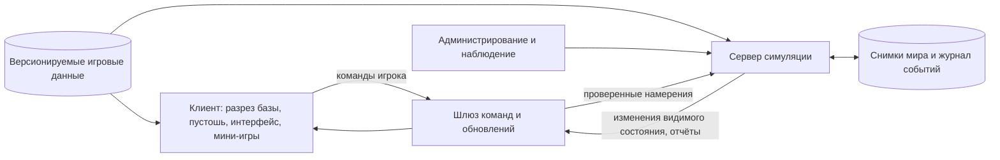

# Архитектура целевой игры «Живой бункер»

Этот документ описывает **целевое устройство игры**. Он связан с [концепцией](Идея.md), [планом реализации](План реализации.md) и [рабочим технологическим стеком](Технологический стек.md). Выбор стека проверяется техническими прототипами; границы игровых систем и их правила понятны заранее.

Первый выпуск — одиночная Windows-игра через VK Play, затем одиночный выпуск в Steam; сетевой сервер и общая территория относятся к более позднему этапу. Масштаб и темп ближайшего вертикального среза заданы в [демо пролога примерно на 30 минут](Этапы/02-GDD/Демо%20%E2%80%94%20пролог%2030%20минут.md), а команды — в [контрактах его систем](Этапы/03-SYSTEMS/Контракты%20систем%20демо-пролога.md); [маршрут первого часа акта 1](Первый игровой час.md) относится к следующему срезу. Порядок магазинов — в [плане публикации](Публикация.md).

Переводимые тексты и настройка языка проектируются с первого экрана по [правилам локализации](Локализация.md).

Представление и звуковая реакция на игровые события следуют [арт- и аудионаправлению](Визуальный стиль и музыка.md).

Правила звуковых событий, приоритетов и дальнего масштаба описаны в [звуковом дизайне](Звуковой дизайн.md).

Структура кода и паттерны работы над модулями описаны в [правилах разработки](Правила разработки.md).

## 1. Принципы

1. **Одна симуляция для всех режимов.** Одиночная игра выполняет библиотеку симуляции локально; сетевая запускает её на выделенном сервере. Правила строительства, экономики, боя и лута не дублируются в представлении клиента.
2. **Клиент показывает мир и отправляет намерения.** Он отвечает за 2.5D-разрез, управление, мини-игры, анимации, звук и предварительный просмотр планов. Сервер решает, возможно ли действие, сколько оно стоит и чем закончилось.
3. **Ничего не происходит мгновенно без причины.** Строительство, перенос, лечение и производство состоят из задач, которые занимают время и требуют исполнителей, инструментов и ресурсов.
4. **Состояние мира объяснимо.** Для остановленной работы можно узнать причину: нет материала, не хватает навыка, проход закрыт, сеть перегружена или исполнитель отдыхает.
5. **Сначала модульный монолит.** Игровые системы живут в одном серверном приложении с чёткими границами. Отдельные процессы и разделение мира добавляются после измерения нагрузки, а не заранее.
6. **Данные отдельно от кода.** Определения предметов, навыков, рецептов, биомов, помещений, событий и технологий хранятся в версионируемых игровых данных с проверкой ссылок и значений.

## 2. Общая схема

В одиночном режиме клиент вызывает симуляцию через локальный интерфейс, а сохранение лежит у игрока. В сетевом режиме `API` принимает удалённые команды, сервер владеет общим миром и сохраняет его централизованно. Клиент получает только известные игроку сведения: базу, наблюдаемые участки и разведывательные отчёты; скрытое состояние мира ему не передаётся.

## 3. Исполнение игровой команды

Путь любого действия одинаков:

`ввод игрока → команда → проверка прав и условий → резервирование ресурсов → изменение состояния или создание задачи → событие → обновление клиента`.

Например, команда «восстановить спальное место в комнате» не создаёт готовую кровать. Симуляция проверяет доступность комнаты, её вместимость и проект, резервирует материалы и создаёт работы на доставку, ремонт и проверку. После завершения оснащение появляется в визуальной схеме комнаты. При завершении каждого шага появляются события, по которым интерфейс обновляет прогресс. Команды имеют уникальный идентификатор: повторная отправка после сбоя связи не должна дважды тратить ресурсы.

**Время:** симуляция идёт дискретными шагами. Взаимодействия, бой и перемещение обрабатываются часто; потребности, производство, семьи и экология могут обновляться реже. Большинство процессов используют игровое время: при скорости 1× 24 игровых часа проходят за 24 реальные минуты, то есть один игровой час за одну реальную минуту. Единые игровые часы управляют сменами жителей; дата и сезон определяют часы рассвета и заката, положение солнца и освещение поверхности. Визуальный слой получает дату и время из симуляции, а не считает их отдельно; переходы между сезонными ориентирами плавные и сохраняются вместе с миром. Отдельно существуют действия, намеренно измеряемые реальным временем, например взлом: ускорение игровых суток не сокращает их таймер. Их прогресс сохраняется вместе с миром. Ускорение времени в одиночном режиме меняет частоту шагов, а не формулы правил. Для сетевого сервера политика паузы и ускорения определяется отдельно.

**Случайность:** сервер выдаёт результаты по управляемым генераторам случайных чисел и фиксирует значимые исходы в журнале. Клиент может показывать ожидаемый диапазон, но не выбирает выпадение награды. Это помогает разбирать ошибки и спорные события.

## 4. Основные сущности данных

| Сущность | Что хранит |
| --- | --- |
| Мир и регион | Координаты, природный биом, климат, погоду, зоны опасности, разведанность и контроль территории |
| Клетка участка бункера | Породу или пустоту, завал, строительный фон, переднюю стену, прочность, воду, температуру и доступность по слоям |
| Помещение | Идентификатор двери-опоры, класс размера, занятый интервал фоновой стены коридора, предел и занятость мест для оснащения, качество конструкции, сети, модули, функции, рабочие места, графики модулей, смены и состояние |
| Предмет | Тип, уровень, число занимаемых мест при установке, базовую скорость и единицу продукта, качество, износ, модификации, владельца, расположение и доступные операции |
| Персонаж | Личность, потребности, здоровье, навыки, развитие, отношения, экипировку, суточное расписание, текущее намерение и задачу |
| Проект | Целевой план, этапы работ, зависимости, материалы, приоритет, исполнителей и прогресс |
| Организация | Поселение, население, роли, политики, права, склады, отношения с другими игроками |
| Экспедиция | Цель, маршрут, участников, припасы, известные угрозы, добычу и состояние возвращения |
| Объект мира | Аванпост, терраформирующую станцию, караван, правительственный сектор и другие внешние объекты |

У каждой сущности есть устойчивый идентификатор. Ссылки на определения типов отделены от индивидуального состояния: «спальный модуль» задаёт свойства по умолчанию, а оснащение конкретной комнаты хранит износ и уровень улучшения. Его видимое положение выбирает схема комнаты, а не ручная клетка игрока. Это позволяет улучшать оснащение и сохранять историю объектов.

## 5. Игровые компоненты сервера

| Компонент | Ответственность | Основные связи |
| --- | --- | --- |
| Мир и пространство | Сетка и её слои, высота и глубина, геология, проходимость, расстояния, обнаружение | Стройка, маршруты, экспедиции, терраформинг |
| Доступ и владение | Права на комнаты, предметы, территории, пленников и сектора; проверка допустимых действий | Команды, обмен, PvP, комплекс |
| Персонажи | Навыки, потребности, здоровье, травмы, развитие, семья, отношения и расписание | Задачи, бой, медицина, поселение |
| Медицина и восстановление | Диагностика ран, лечение, инфекции, отдых, эпидемии и расход медикаментов | Персонажи, комнаты, экономика |
| Общество и культура | Семьи, поколения, отношения, мораль, культурные синергии и миграция | Персонажи, поселение, торговля |
| Цели и задачи | Разложение приказа на работы, зависимости, приоритеты, выбор исполнителей с учётом смены, пауза и отмена | Все системы, где требуется труд |
| Строительство | Проекты, раскопки, укладка фона, передние стены, опоры, двери, перепланировка, качество исполнения, износ | Мир, задачи, комнаты, сети |
| Комнаты и оснащение | Выбранная конфигурация, вместимость, рабочие места и покрытие смен, работающие функции, специализация, ремонт и улучшение | Стройка, задачи, производство, потребности |
| Инженерные сети | Энергия, вода, воздух, тепло, стоки, связи; мощность и аварии | Комнаты, здоровье, производство |
| Сеть убежищ и передатчики | Изготовление, доставка и подключение передатчика, состояние связи, мгновенное переключение экрана и всех обычных ручных команд жителям и стройке без перемещения героя, автономные приказы без связи, блокировка удалённого управления после активации «Зоны 0» | Мир, права, задачи, интерфейс, комплекс |
| Экономика и логистика | Запасы, резервы, склады, рецепты, производство, комната снабжения и её правила отправки между бункерами, перенос, разбор и торговля | Задачи, комнаты, экспедиции, сеть убежищ |
| Торговля и дипломатия | Караванные сделки, цены, отношения организаций, договоры и обмен пленными | Экономика, мир, владение |
| Исследования и технологии | Базовый выпуск 1 очка науки за час работы модуля уровня 0 с назначенным сотрудником, бонусы комнаты и навыка, связь и накопление, проект на базе героя, уровни технологий и местное внедрение | Экспедиции, персонажи, задачи, комнаты, экономика, комплекс |
| Политики поселения | Шаблоны приоритетов, минимальные запасы, управление группами и районами | Задачи, экономика, жители |
| Внешний мир и разведка | Биомы, сезоны, погода, неполные сведения, события пустоши и обнаружение | Экспедиции, терраформинг, бой |
| Генерация мира и события природы | Начальная геология и биомы, сезонные изменения, засуха, бури и локальные опасности | Мир, инженерные сети, экспедиции |
| Экспедиции и транспорт | Подготовка, движение, припасы, возврат, эвакуация, караваны, позже вертолёты | Мир, логистика, бой |
| Бой и последствия | Действия ИИ, приказы игрока, боевые зоны коридоров, переходы между рубежами, урон, травмы, плен и спасение | Персонажи, медицина, пространство, двери |
| Эволюция | Люди, мутации, импланты, псионика, сочетания и издержки | Персонажи, культура, биомы |
| Терраформинг | Экологическое влияние базы, проекты станций, устойчивость и переходы биомов | Мир, сети, экономика, владение |
| Правительственный комплекс | Сектора, оборона, уровни доступа, центральный ИИ, технологии и контроль | Бой, разведка, права, экономика |
| События мира | Локальные и серверные события, открытия, первые достижения и последствия решений | Все игровые компоненты |
| Локализация представления | Преобразование ключей и параметров в текст выбранного языка, форматирование чисел и сообщений | Клиент, контент, журнал, интерфейс |

Компоненты общаются через явные команды, запросы состояния и события. Например, строительство не снимает материалы со склада напрямую: оно запрашивает резерв у экономики и создаёт задачу переноса. Так проще понять, где предмет находится и почему работа остановилась.

## 6. Как устроены ключевые механики

### Строительство и перепланировка

Игрок выбирает место двери вдоль доступного коридора и размер комнаты. Команда создаёт проект с классом «маленькая / средняя / большая / огромная», резервирует 4/6/10/16 клеток стены и даёт 8/16/32/64 места под оснащение. Дверь имеет габарит 2 × 3 клетки; у маленькой комнаты её горизонтальный интервал — клетки 2–3 проекта, у средней — 5–6. Позиции для больших размеров зададим отдельно. Предпросмотр показывает и дверь, и полную границу комнаты. Симуляция проверяет предполагаемый контур, пересечения с соседними дверями и помещениями, прочность грунта, путь и сети. Если нужен подход, проект включает его. После подтверждения система создаёт граф работ: обследовать → открыть доступ → расчистить → возвести фон и передние стены → подготовить проход и дверь → подвести сети → доставить и установить модули → проверить. Изменения клеток породы и конструкций — результаты задач, а не прямые команды игрока. Проход по коридору не сужается. Отдельный проект настройки хранит желаемые функции и модули оборудования; каждый тип модуля расходует заданное число мест. Отмена проекта возвращает ещё не израсходованные резервы; завершённые работы остаются физическими изменениями мира. Подробные правила — в [схеме строительства](Слои строительства.md).

Поиск пути различает рост стоя и габарит пригнувшегося персонажа. Коридор первого уровня высотой 4 кубика свободен для стартовых силуэтов до 3 кубиков; дверной проём с чистой высотой 2,5 кубика переводит крупного персонажа в позу пригибания только на пороге. Если снаряжение или груз не позволяет пройти даже в этой позе, переход недоступен и интерфейс показывает причину.

Навык исполнителя влияет на время, расход и качество каждого этапа. Для сложных работ требуется квалификация или повышается риск ошибок, которые обнаруживаются при проверке либо эксплуатации. Качество комнаты можно повысить повторной работой, не уничтожая всю комнату. При массовой перепланировке проекты запускаются в безопасном порядке с учётом временных складов и работающих путей; игрок видит, какие помещения временно недоступны.

### Назначение комнат

Игрок открывает карточку через дверь и выбирает стационарные предметы обустройства. Симуляция проверяет, что сумма занятых мест не превышает предел размера комнаты, и хранит **желаемую конфигурацию** отдельно от установленного и работающего оборудования: выбор доступен сразу, но функция включается после установки исправного модуля, обеспечения места, пути и сетей. Установленный модуль принадлежит комнате и сохраняет состояние при ремонте, улучшении и переносе; переносимые вещи и ресурсы остаются отдельными предметами склада или инвентаря. Уменьшение комнаты с лишними модулями отклоняется до их переноса, без удаления предметов. Тип комнаты определяется готовым набором модулей. Минимальный набор кровать 2 места + холодильник 1 + плита 3 + очиститель 2 даёт комнате выживания +10% к качеству; полное заполнение кроватями, кухонной парой или опреснителями даёт +200% к качеству соответствующей функции. Уровень комнаты добавляет +1% к качеству за уровень, уровень предмета — +10% к качеству его результата. Эти бонусы не повышают автоматически выпуск или характеристики персонажа. Наборы и формула хранятся в данных баланса и описаны в [оборудовании и комбинациях комнат](Оборудование и комбинации комнат.md).

У каждого производственного модуля есть рецепт, базовая скорость с единицей продукта, уровень, требования к сырью и сетям, почасовой график и накопленный дробный прогресс. Комната хранит уровень и бонусы, персонаж — профильные навыки и занятость по часам. Симуляция связывает модуль с фактически работающим персонажем, запрещает пересечение его смен и считает выпуск за прошедшую долю игрового часа; прогноз и факт выводятся отдельно. Числа уровня 0 и общая формула приведены в [расчёте производства](Расчёт производства.md). Сохранение фиксирует графики, запасы и незавершённый прогресс, чтобы загрузка не создавала лишний выпуск.

### Самостоятельные жители

Игрок задаёт цель: «поддерживать запас аптечек» или «перестроить спальни». Планировщик разбивает её на конкретные работы. Жители выбирают доступную задачу по приоритету, навыку, пути и собственному состоянию. Потребности способны прерывать работу. Причина отказа или задержки записывается в задаче и показывается игроку. На больших поселениях политики управляют группами, но данные каждого жителя сохраняются.

### Штурм бункера и боевые коридоры

Симуляция строит граф рубежей из улицы, коридоров каждого уровня, лестниц, лифтов и дверей комнат. При штурме через главный вход враги сначала находятся на поверхности, затем могут пройти в коридор первого уровня и лишь после захвата подхода к вертикальному узлу — в коридор ниже. Переход определяется проходимостью и положением бойцов; отдельной команды «переключить фазу» нет. Коридор хранит тактическое состояние: контролирующую сторону, позиции, укрытия, баррикады, свет, дым, огонь и повреждения. Дверь комнаты создаёт отдельную ветвь маршрута и не отдаёт комнату автоматически при потере коридора. Сохранение фиксирует бойцов и состояние каждого рубежа, чтобы загрузка не сбрасывала штурм. Правила для игрового сценария описаны в [обороне бункера](Оборона бункера.md).

### Пустошь, сведения и мини-игры

Разведка создаёт отчёты с источником, временем получения и достоверностью. Интерфейс не открывает игроку всю скрытую карту. Экспедиционные события задаются условиями, вариантами выбора, проверками навыков и последствиями: ресурсы, травмы, отношения и информация.

Взлом терминала и механического замка — длительные задачи с исполнителем, инструментом, таймером реального времени и сохраняемым прогрессом. При наличии нужного доступа персонаж заканчивает их сам через несколько минут. Клиент по желанию показывает короткую мини-игру: соединение проводов, поворот плиток для прохождения сигнала или работу с механическим замком. Успех отправляется на проверку симуляции и уменьшает оставшееся время; отказ от мини-игры или ошибка не прерывают автоматическую работу. Сервер хранит прогресс и проверяет результат, поэтому клиент не может открыть объект одним поддельным сообщением. Для особых дверей могут также существовать код, ремонт, ключ или силовой обход.

### Терраформинг

У участка есть природный биом, текущее состояние, устойчивость и влияния соседей. База создаёт медленное экологическое давление через реальные сооружения и деятельность. Станция задаёт целевой биом, расходует ресурсы и усиливает давление в зоне действия. Переход происходит постепенно; на границе влияний возникают смешанные участки. При отключении поддержки участок продолжает жить по своим природным условиям. Бонусы персонажам и классам зависят от текущих условий участка, поэтому смена биома меняет экономику и экспедиции, а не только цвет фона.

### Правительственный комплекс

Комплекс — набор связанных секторов со своим состоянием, обороной и уровнем доступа. Центральный ИИ создаёт угрозы и реагирует на проникновение. Обнаружение технологии выдаёт знания или экземпляр оборудования; производство, ремонт и обслуживание затем проходят через обычные цепочки экономики. Контроль сектора хранится отдельно от доступа к технологии: можно исследовать часть комплекса, не владея всем объектом. Захват и потеря командного пункта публикуются как события сервера.

## 7. Клиент и интерфейс

Клиент состоит из нескольких представлений одного мира:

- **Разрез бункера:** этажи, комнаты, предметы, жители, сети, строящиеся участки и видимые повреждения.
- **Режим расширения комнат:** места будущих дверей, контур автоматически строящихся фона, передних стен и прохода, сравнение «до/после», стоимость и порядок работ.
- **Карточка комнаты:** назначение, набор функций, уровень оснащения, ремонт, улучшение и причина, по которой выбранная функция ещё не работает.
- **Управление поселением:** задачи, запасы, политики, профессии, здоровье, причины простоев и отчёты по районам.
- **Пустошь и экспедиции:** доступные из разведки места и отчёты, решения в событиях, отряд, риск и груз. Это интерфейс сведений, а не всеведущая глобальная карта.
- **Бой:** наблюдение за действиями персонажей и точечные приказы героя или командира.
- **Взаимодействия:** взломы, ремонт, крафт, медицина, диалоги, предметы и история персонажей.
- **Звуковой слой:** по новым событиям симуляции выбирает варианты эффектов, точку звучания, громкость и приоритет; управляет фоном, музыкой и настройками игрока. Воспроизведение звука не меняет игровые правила.

Интерфейс может предварительно посчитать стоимость и показать прогноз, но окончательный результат подтверждает симуляция. Событие содержит ключ сообщения и параметры, достаточные для объяснения результата без доступа к скрытым данным. Клиент переводит его на выбранный язык; смена языка не меняет состояние мира или сохранение.

## 8. Сетевая игра и общая территория

В сетевом режиме сервер является источником истины. Он проверяет права игрока, доступность ресурсов и физическую возможность команд. Обмен предметами, захват земли и бой выполняются как атомарные изменения состояния, чтобы две стороны не могли получить одну и ту же вещь одновременно.

Сначала один серверный процесс ведёт ограниченный общий мир. При росте нагрузки мир можно разделить на регионы с явной передачей персонажа, каравана или экспедиции между владельцами регионов. Такое разделение потребуется только после измерения нагрузки; оно не должно менять игровые правила. Сообщения клиентов содержат версии наблюдаемого состояния и идентификаторы команд, чтобы корректно обрабатывать задержки и повторы.

Для участков, которые никто не наблюдает, сервер обновляет медленные процессы реже и рассчитывает накопленный результат при возвращении внимания. Личности, ресурсы и последствия при этом сохраняются. Активные бои, строительство и встречи игроков требуют подробной симуляции. Цель — масштабировать вычисления, не подменяя жителей безымянными единицами населения.

## 9. Сохранения, контент и диагностика

Состояние периодически записывается снимками, между ними ведётся журнал всех изменений, нужных для восстановления мира после последнего снимка. При загрузке сервер восстанавливает последний снимок и применяет последующие изменения. Отдельный журнал значимых игровых событий служит истории мира и интерфейсу. Схема сохранения версионируется; миграции проверяются на старых игровых мирах. Для сетевой игры дополнительно нужны резервные копии и контроль повреждения данных.

Редактор игровых данных проверяет уникальность идентификаторов, существование ссылок, допустимость чисел и отсутствие циклов в обязательных рецептах и работах. Сценарии, предметы, биомы и технологии можно добавлять пакетами контента. Изменение баланса записывается вместе с версией мира, чтобы понимать, по каким правилам произошли события.

Диагностика показывает время игрового шага, число активных жителей и задач, длину очередей, дорогие маршруты, загрузку сетей, частоту сохранений и ошибки команд. Для игрока важнее другая диагностика: понятное объяснение, почему производство или строительство стоит.

## 10. Что закладываем сразу, а что добавляем позже

**Сразу:** устойчивые идентификаторы, отделённая симуляция, команды и события, версии данных, сохранение незавершённых задач, резервирование ресурсов, объяснимые причины отказа, измерение нагрузки.

**После первого играбельного цикла:** универсальный планировщик множества жителей, сложные инженерные сети, семьи, терраформинг, большой мир, политика владения и глубокий правительственный комплекс.

**После измерений крупных одиночных поселений:** оптимизация симуляции тысяч жителей. Разделение мира между процессами и массовые серверные события рассматриваются лишь после сетевого прототипа. Начальная структура симуляции должна допускать эти шаги, но не реализовывать их заранее.

## 11. Решения, которые ещё нужно принять

1. Подтвердить на прототипе рабочий стек Godot .NET, C# и JSON-контент; зафиксировать совместимые версии.
2. Подтвердить на Windows и Linux цели по памяти и производительности.
3. Проверить в прототипе сетку уровней 100 × 12 кубиков, дверь высотой 4 кубика и видимость двух уровней при стандартном масштабе.
4. Проверить темп первого часа: день в 24 реальные минуты, паузу, движение солнца и отдельные таймеры взлома.
5. Определить темп последующих систем: сезонов, взросления, большого производства и поздней сетевой версии.
6. При работе над сетевой версией определить владение территорией, PvP, переход контроля над комплексом и резервирование ресурсов при отключении сервера или игрока.

Эти решения фиксируются после соответствующих прототипов и затем обновляются в этом документе.
