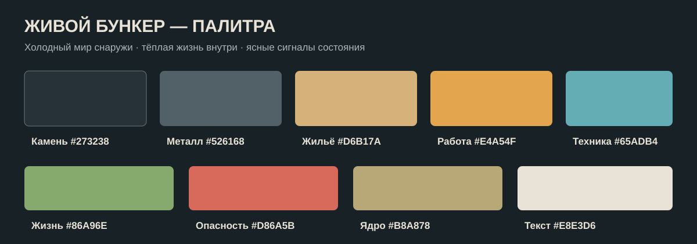

# Визуальный стиль и музыка «Живого бункера»

**Фирменное направление — «Слоистый свет»:** простая графическая диорама, где тёплая жизнь буквально прорезает тёмные слои земли. Игра должна быть узнаваемой по ступенчатому геологическому разрезу, скошенным рамам помещений и коротким вертикальным янтарным светильникам у проходов. Игрок с обычного масштаба различает комнату, её функцию, состояние, опасность и происходящую работу.

Звуки предметов, окружения, предупреждений и большого поселения подробно описаны в [звуковом дизайне](Звуковой дизайн.md).

Референсы из [концепции](Идея.md) описывают игровые ощущения и формат камеры. [Стилевой лист](art/concepts/graphic-style-sheet.png) и его [упрощённый вариант](art/concepts/graphic-style-sheet-simple.png) задают форму графики; применение прежних кадров как композиционных ориентиров описано в [арт-концепции](Арт-концепция.md).

## 1. Художественный образ

Мир пережил катастрофу, но не застыл в руинах. Снаружи — выгоревшие конструкции, пыль, вода и растительность, которые постепенно возвращают себе пространство. Внутри — следы ремонта: разные материалы на стенах, подписанные ящики, самодельные воздуховоды, старые и новые станки рядом. Чем больше у поселения знаний и труда, тем сложнее и чище становится инфраструктура; ранние комнаты сохраняют собственную историю.

Игра показывается в **2.5D**: основа изображения — простая иллюстративная графика, а объём создают глубина пола и стен, перекрытия планов, ограниченный параллакс и локальный свет. У предмета два-три сплошных тона и чёткий тёмный контур; износ передают несколькими крупными сколами и заплатами. Без фотореалистичных материалов, мелкой фактуры и живописных градиентов. Порода читается широкими ступенчатыми пластами, стены — рамами со скошенными углами, работающая инфраструктура — короткими янтарными световыми метками. Перспектива не должна мешать строительной сетке.

**Глубина игрового разреза:** помещения остаются в боковом разрезе, но их пол уходит от переднего края назад и немного вправо. Видны задняя стенка, боковая грань, толщина потолка и переднего перекрытия. Двери и крупные наземные постройки получают такую же короткую боковую грань и тень. Передний край пола остаётся привязан к строительной сетке; перспектива меняет изображение глубины, а не координаты дверей и длину коридора. Этот приём проверен на [первом кадре из Godot](art/concepts/godot-first-screen-depth.png); глубину и пропорции ещё можно уточнять по игровому масштабу.

Персонажи компактные, примерно **четыре головы в высоту**, с простыми лицами и выразительной позой. Индивидуальность дают волосы, одежда, инструменты, заплаты и изменения тела. Силуэт должен читаться без увеличенной головы и без мелких портретных деталей. Предметы и жители остаются понятными при обычном масштабе камеры. Для каждого игрового объекта сначала утверждаем чёрный силуэт, затем цвет, затем небольшие детали.

Правила внешности и видимые изменения жителей уточняет [концепция персонажей](Персонажи.md).

**Отличительный набор:** ступенчатые пласты породы; скошенная металлическая рама комнаты; вертикальный янтарный свет у двери; треугольная заплата как знак ремонта и обживания; чёткое противопоставление тёмной земли и тёплого помещения. Эти мотивы повторяются в мире, иконках и экранах меню, но не превращаются в декоративный шум. Обходятся без ретрофутуристической рекламы, маскота и узнаваемых образов других игр.

## 2. Палитра

| Роль цвета | Базовый тон | Где применяется |
| --- | --- | --- |
| Камень и дальний фон | `#273238` | Порода, неосвещённые участки, отделение пустоты от построенного |
| Старый металл | `#526168` | Довоенные двери, станки и каркасы |
| Тёплая обжитая зона | `#D6B17A` | Свет жилья, кухни, места отдыха |
| Рабочий янтарный | `#E4A54F` | Стройка, активная работа, выбранный проект |
| Холодная технология | `#65ADB4` | Терминалы, работающая электроника, информационные сети |
| Жизнь и восстановление | `#86A96E` | Здоровье, растения и восстановленные биомы |
| Опасность | `#D86A5B` | Ранение, пожар, авария и подтверждённая угроза |
| Редкая довоенная власть | `#B8A878` | Акценты правительственного комплекса и уникальных технологий |
| Основной текст | `#E8E3D6` | Интерфейс поверх тёмного фона |

Это **цветовые токены**, а не обязательный цвет каждого пикселя. Фон сохраняется спокойным, чтобы работа, герой и опасность выделялись. Значение цвета всегда дублируется формой, иконкой или подписью: красный не должен быть единственным способом узнать об аварии. Контраст текста и цветовых состояний проверяется на готовом экране и при различных настройках отображения.

## 3. Свет, биомы и развитие базы

- **Пространственный кадр:** поверхность и дорога тянутся вправо от входа слева; на земле остаётся место для будущих построек. За охраной виден вертикальный узел с лестницей и неработающим лифтом; следующий слой комнат расположен ниже. Руины и дальние силуэты задают направление мира, а детали неизвестных мест раскрываются через разведку. [Схема](Пространственная схема мира.md) служит ориентиром для макета камеры.
- **Первый вход:** почти тёмный тамбур, холодный дневной свет в щелях, один работающий индикатор терминала. Вскрытие двери открывает следующий слой пространства.
- **Охранная комната:** холодный свет старой электроники, строгие линии, пыль и следы долгого простоя.
- **Первый жилой зал:** серый завал и сломанная кровать. После расчистки появляется видимая площадь; после очага — небольшой тёплый центр комнаты. Игрок должен увидеть сделанную работу без открытия панели статистики.
- **Развитый бункер:** функциональные районы читаются по оборудованию и свету: жильё тёплое, производство контрастнее, медицина чище, лаборатории холоднее. Цвет района помогает ориентироваться, но не заменяет предметы и таблички.
- **Пустошь:** на маршруте используются иллюстрированные карточки мест и состояния погоды. Каждому биому свойственны силуэт, материал и характер света: лес — зелень и тёмные стволы; пустыня — охра и резкие тени; болото — влажные отражения; руины — бетон и ржавчина; заражённая зона — неестественные локальные акценты. Карточка остаётся частью интерфейса сведений, а не всеведущей картой.
- **Сезоны, сутки и погода:** дальний план меняет растения, снег и свет. Солнце движется по небу отдельно от панорамы, следуя игровым часам: 24 часа за 24 реальные минуты при 1×. Часы восхода, заката и высота солнечной дуги меняются по сезону, поэтому летом света больше, зимой меньше. Осадки и опасные явления накладываются отдельными слоями. [Сезонные панорамы и погодные эффекты](Панорамы и погода.md) задают визуальные состояния; игровая поверхность и постройки остаются отдельным передним планом.
- **Терраформинг:** изменение биома видно стадиями: новые растения или осадок, изменение влаги и цвета земли, затем устойчивые объекты среды. Переходная полоса двух биомов сохраняет признаки обоих, чтобы столкновение влияний было видно на местности.
- **Эволюция жителей:** импланты, мутации и псионические признаки меняют силуэт и детали персонажа. На дальнем масштабе достаточно крупных признаков; при приближении видна индивидуальная история.
- **Правительственный комплекс:** холодная довоенная симметрия, большие пустые залы, точечный строгий свет, редкие золотистые знаки власти и активные оборонительные устройства. Он должен ощущаться построенным по иной культуре и технологии, чем самодельный бункер игрока.

## 4. Изображение работы и состояния предметов

Каждый важный объект имеет минимум четыре читаемых состояния: **проект**, **в работе**, **готов и включён**, **повреждён или выключен**. Проект показывается тонким контуром и местом будущего подключения. Во время работы видны принесённые материалы, инструмент, открытая панель или временные подпорки. Готовый предмет меняет помещение физически. Повреждение отмечается формой и деталями, а не только красной заливкой.

На первом экране особенно важны терминал, ящик, завал, кровать, очаг, вентиляционная шахта и сам герой. Их силуэты должны различаться без текста. По сетке кубиков из [схемы первого наземного уровня](Первый наземный уровень.md) игрок размещает только проект двери комнаты. Предпросмотр показывает будущий контур, фон, передние стены и сохранённый проход; во время работ эти элементы появляются поэтапно. Дальний панорамный фон не смешивается со строительным фоном комнаты. Оснащение появляется в комнате после заказа в карточке двери; его силуэты не должны мешать чтению проходов и рабочих мест.

При далёком обзоре тысячи жителей не рисуются одинаково подробно: остаются читаемые группы, маршруты и занятость районов. При приближении снова видны отдельные персонажи и их оснащение. Это правило относится к представлению; симуляция сохраняет состояние каждого жителя.

## 5. Интерфейс и типографика

Интерфейс напоминает **современный инженерный пульт, собранный из уцелевших технологий**: чёткая сетка, спокойные тёмные панели, читаемые подписи, немного металлических рамок. Постоянно видны герой, время, здоровье, силы и текущая задача. Строительный режим показывает слои сетей и работ; вне него технические линии скрыты.

Для коротких заголовков допустим характерный технический шрифт. Основной текст событий и длинные описания набираются простым шрифтом с хорошей читаемостью кириллицы и латиницы. Панели растягиваются и переносят текст для русского и английского. Числа, единицы и сообщения форматируются по [правилам локализации](Локализация.md). Иконка всегда получает подпись или доступную текстовую подсказку.

Анимация интерфейса короткая и функциональная: она показывает завершение работы, изменение состояния или новое сведение. Долгие декоративные переходы не должны задерживать частые действия игрока. Пульсация и мигание используются редко и отключаются отдельной настройкой снижения движения.

## 6. Музыкальная идея

Музыка отражает переход от одиночества к построенной своими руками жизни. Её основа — негромкие аналоговые синтезаторы, обработанный металлический звук, редкие струнные и сухая перкуссия. Мелодические темы короткие и узнаваемые; в обычной работе между ними остаётся место для звуков бункера. Саундтрек не должен непрерывно давить тревогой, пока игрок долго планирует производство.

| Состояние | Музыка и ощущение |
| --- | --- |
| Подход к закрытому бункеру | Редкие низкие ноты, ветер и слабый радиосигнал; ожидание неизвестного |
| Взлом и исследование | Тихий ритм электроники, короткие сигнальные фразы; ясный звук успешного соединения |
| Первый обжитой зал | Тёплый устойчивый мотив поверх звуков очага и инструментов; первая победа без фанфар |
| Обычная жизнь поселения | Несколько спокойных вариаций одной темы, которые чередуются с естественной тишиной |
| Вылазка и выбор риска | Ритм усиливается по мере приближения к событию; после решения он уступает место последствиям |
| Травма и возвращение | Музыка становится редкой и хрупкой; восстановление возвращает знакомый домашний мотив |
| Бой и авария | Пульс, низкая перкуссия и напряжение, которые не заглушают приказы и сигналы опасности |
| Ядро мира | Более строгая и чуждая версия главной темы; следы довоенной мощи, а не просто более громкая музыка |

Темы поселения, пустоши и правительственного комплекса используют несколько общих нотных оборотов. Игрок слышит, что это части одного мира, даже когда меняются инструменты и настроение. Музыка может реагировать на состояние игры слоями: добавить ритм при угрозе, убрать его при возвращении к планированию, задержать смену до подходящего музыкального момента. Переходы должны быть плавными и редкими, без переключения трека при каждом открытии меню.

## 7. Звуковая среда и управление громкостью

У каждой зоны есть тихая среда: вентиляция и капли в бункере, инструменты в мастерской, ветер и далёкие конструкции снаружи. Важные действия имеют узнаваемые короткие сигналы: щелчок замка, подтверждение проекта, доставка материалов, поломка сети, завершение лечения. Сигнал опасности сопровождается видимым сообщением; звук не является единственным источником информации.

Игрок отдельно регулирует **общую громкость, музыку, окружение, действия и интерфейс**. Во время диалога или важного сообщения музыка приглушается. Резкие пики ограничиваются, а длинная работа не сопровождается навязчиво повторяющимся звуком. Для первого выпуска планируется текст на русском и английском, без обязательной озвучки; поэтому все игровые сведения доступны без голоса.

Музыка и эффекты создаются или лицензируются с правом выпуска в VK Play и Steam. Исходники, лицензия и авторство хранятся рядом с записью об ассете. Временный звук прототипа явно помечается и заменяется до публичной сборки.

## 8. Что сделать для первого вертикального среза

1. Серый экран: вход, охранная комната, заваленный зал, герой и все рабочие состояния без финального арта.
2. Один законченный экран после установки очага по стилевому листу «Слоистый свет»: проверить контур, два-три тона на объект, читаемость силуэтов, палитру и русский/английский интерфейс.
3. Три иллюстрированные карточки маршрута: старый тоннель, разрушенный склад и обрушенный пролёт.
4. Короткая музыкальная тема бункера с двумя состояниями — холодное пустое помещение и тёплый обжитой зал.
5. Небольшой набор звуков: терминал, замок, расчистка, ремонт, очаг, шаги, уведомление о травме и лечение.

**Критерий стиля:** при обычном масштабе и при уменьшении до половины размера новый игрок без подсказки различает дверь, терминал, завал, кровать, очаг и профессию жителя. Если для этого требуется мелкая фактура или яркая подсветка всего объекта, силуэт переделывается. Оформление проверяется в игре, прежде чем производить десятки комнат и предметов.
