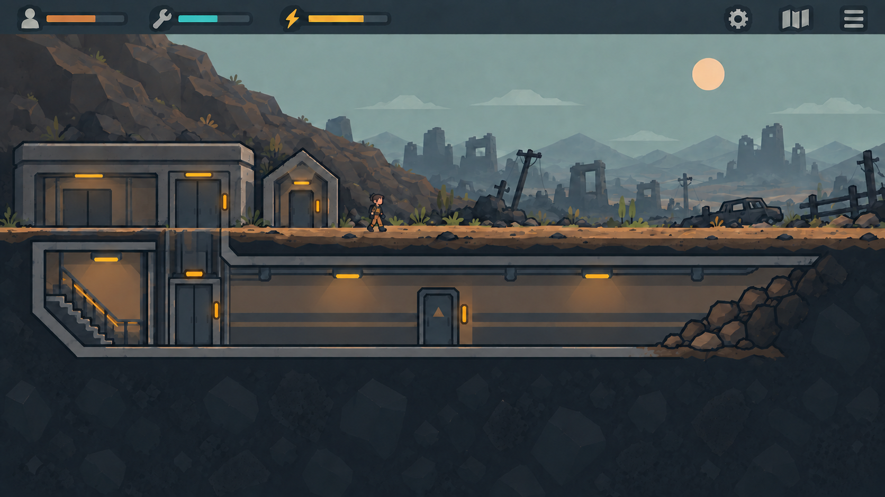

# Игровой экран: поверхность и первый подземный этаж

Этот художественный экран сделан до [новой планировки по эскизу](Планировка первого экрана по эскизу.md). Для координат входа, лестницы, лифта, руин, КПП и завала используйте новую схему; изображение ниже остаётся ориентиром по цвету и атмосфере.

Визуальный макет игрового кадра в упрощённом стиле «Слоистый свет», выполненный по наброску расположения. Слева на поверхности стоят широкий наземный блок с заметным входом в лифт и отдельный небольшой вход в бункер. Наземная дверь лифта расположена прямо над его шахтой. За постройками склон; дорога и панорама руин уходят вправо. **Под поверхностью только один этаж:** слева лестница и лифт, далее длинный коридор с одной дверью маленькой комнаты ближе к центру. Справа коридор упирается в нерасчищенную породу. Содержимое комнаты на основном экране не показывается: игрок настраивает её через карточку двери.

Это иллюстрация композиции и атмосферы. Точные размеры, границы комнаты и привязка двери к сетке определяются пространственной схемой и проверяются в игровом прототипе.

## Промпт генерации

Встроенный `imagegen`; визуальные референсы: предыдущий игровой экран и набросок пользователя. Предыдущие варианты сохранены как `art/concepts/game-screen-surface-floor-1.png`, `art/concepts/game-screen-surface-floor-1-v2.png` и `art/concepts/game-screen-surface-floor-1-v3.png`.

> Edit only the upper-left surface building of the previous game screen. In its right bay, replace the narrow generic door with a broad full-height two-panel sliding elevator door: clear center seam, steel jamb, amber indicator above and illuminated call button beside it. Align this surface door directly over the visible elevator shaft and cabin below so the vertical connection reads clearly. Preserve the large opening in the building's left bay, separate peaked entrance, exactly one underground level, staircase, elevator, corridor with one room door, right-hand rubble, landscape, HUD, scale and flat 2D style. No extra rooms, floors, doors or text.
