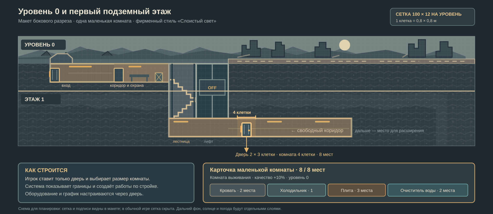

# Макет уровня 0 и первого подземного этажа

Этот ранний разрез был создан до добавления разделительного слоя. Для нового рисунка используем [сетку с двухклеточным перекрытием](art/concepts/game-screen-layout-grid.png); именно она задаёт актуальное расстояние между этажами.

Это схема для проверки масштаба, обзора камеры и размещения первой маленькой комнаты. Оба уровня имеют сетку **100 × 12 клеток**; одна клетка — **0,8 × 0,8 м**. Игровая сцена продолжается вправо по поверхности, а под землёй коридор идёт от лестницы к новой двери.

| Элемент | Координаты и смысл |
| --- | --- |
| Уровень 0 | Поверхность, дорога и руины справа; вход слева, затем коридор, старая охрана, лестница и отключённый лифт |
| Первый подземный этаж | Непрерывный коридор от лестницы вправо; на макете добавлена **одна** маленькая комната |
| Маленькая комната | Полоса `x = 48…51`: 4 клетки (3,2 м) вдоль коридора, 8 мест для оборудования |
| Дверь комнаты | Клетки `x = 49…50`, 2 клетки ширины × 3 клетки высоты (1,6 × 2,4 м); внутри рамы чистая высота 2 м |
| Карточка комнаты | Кровать 2 места + холодильник 1 + плита 3 + очиститель воды 2 = **8/8 мест**; бонус комнаты выживания **+10% к качеству** |

Игрок размещает дверь и видит границу всей комнаты. Конструкции, фон и проход строятся по проекту; оборудование выбирается в карточке двери. На макете сетка включена специально для проверки размеров. В обычной игре она скрыта, а передние стены можно приглушить для обзора.

Макет показывает один вариант уже построенного первого этажа, чтобы проверить дверь и комнату в общем разрезе. Сюжетный заваленный зал пролога и дальнейшие комнаты будут прорабатываться отдельно.
