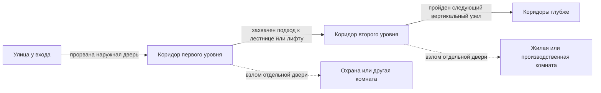

# Оборона бункера: бой по рубежам

При нападении через главный вход бой развивается **по реальному пути атакующих**, от поверхности вглубь базы. Коридор каждого уровня — отдельная **боевая зона**, даже когда он не является производственной комнатой. Герои, жители, враги, двери и повреждения остаются в том же 2.5D-разрезе мира.

## Фазы штурма

| Фаза | Где идёт бой | Что важно |
| --- | --- | --- |
| 1. Поверхность | Перед входом, у дороги и наземных построек | Подход противника, укрытия руин, обзор, погода, наружная оборона и отход защитников к гермодвери |
| 2. Первый коридор | От наружной двери до лестнично-лифтового узла | Узкий проход, внутренние двери, пост охраны, свет, дым, огневые точки и риск прорыва к спуску |
| 3. Второй уровень | Коридор у выхода с лестницы или лифта | Новый рубеж; защитники могут отступить и закрыть проход, а враги должны реально спуститься |
| 4. Глубокие уровни | Последующие коридоры и узлы | Оборона повторяется по планировке конкретного бункера; каждый захваченный участок открывает доступ дальше |

Фаза меняется, когда враги **проходят или захватывают границу рубежа**, а не после обнуления условной шкалы. Если наружная дверь цела, бой остаётся снаружи. Если коридор удержан, враги не переходят на следующий уровень. Отряд может отступить, перегруппироваться или уйти, поэтому штурм не обязан закончиться захватом всей базы. Другие виды проникновения, например туннель или высадка, в будущем начнутся у фактического места прорыва; приведённая последовательность относится к нападению через главный вход.

## Коридор как боевая зона

Коридор хранит ширину, проходимость, укрытия, освещение, обзор, состояние воздуха, огня и дыма. В нём есть позиции для защитников, но число бойцов одновременно ограничено шириной и линией огня. Бойцы перемещаются по кубиковой сетке; крупные персонажи, носилки и грузы требуют свободного прохода. Передние стены, возведённые по проекту комнаты или коридора, могут служить укрытием и разрушаемой преградой; строительный фон не перекрывает движение. Расстановка баррикад, турелей, датчиков и аварийного света относится к **оснащению коридора**, а не к карточке обычной производственной комнаты. Эти средства требуют строительства, энергии, обслуживания и могут быть повреждены.

Двери комнат — ответвления от боевого маршрута. Атакующий может идти дальше по коридору или вскрыть конкретную дверь ради цели: добычи, саботажа, заложников либо обхода обороны. Комнаты не захватываются автоматически вместе с коридором. Закрытая дверь задерживает врага, но также влияет на эвакуацию своих; игрок видит обе стороны решения. Пост охраны поддерживает первый коридор наблюдением и бойцами, не перекрывая единственный путь к лестнице.

Крупный боец ростом больше 2,5 кубика пригибается при проходе через открытую дверь комнаты. В коридоре высотой 4 кубика он сражается в полный рост. Дверь занимает 2 × 3 клетки; свободная высота внутри рамы — 2,5 клетки. Порог остаётся узким местом, а число одновременно проходящих бойцов зависит от их фактической ширины и снаряжения.

Размер комнаты резервирует [отрезок стены коридора](Комнаты и двери.md) длиной 4, 6, 10 или 16 клеток, но не уменьшает ширину боевого прохода. Дверь у всех четырёх размеров остаётся точкой входа шириной две клетки; огромная комната не становится открытым проломом вдоль всей стены. При пробитии передней стены граф проходов пересчитывается по фактическим клеткам.

После тревоги игрок выбирает оборонительный приказ: **держать улицу**, **встретить в коридоре**, **отступить к следующему уровню** или **эвакуировать и закрыть секцию**. Жители с боевой подготовкой идут к назначенным позициям с учётом пути и времени; остальные уходят в безопасные комнаты, помогают раненым или выполняют аварийные задачи. Сам бой идёт автоматически; игрок может помогать команде [всплывающими реакциями](Этапы/02-GDD/Боевая%20система%20%E2%80%94%20автоматический%20бой%20и%20реакции.md) или наблюдать без ввода. Тактические приказы до боя не заменяют реакций во время схватки.

## Состояние мира и последствия

- Система строит граф боевых зон из поверхности, коридоров, вертикальных узлов и дверей комнат. Переход разрешён лишь при доступном физическом пути; лифт не переносит отряд мгновенно и зависит от питания и состояния.
- Для каждого участка сохраняются владелец или степень контроля, участники, укрытия, открытые и повреждённые двери, огонь, дым и оставленные предметы. Пауза, сохранение и загрузка не сбрасывают ход штурма.
- Захват коридора прерывает логистику через него и работу комнат, до которых больше нет безопасного пути. Люди могут оказаться отрезаны; интерфейс показывает их положение и доступные маршруты эвакуации.
- После боя остаются раненые, разрушения, истраченные боеприпасы, неисправное оборудование и работы по расчистке. Защита может вновь пользоваться коридором после восстановления прохода и систем.

**Сюжетная атака пролога — отдельный учебный случай.** Первый бункер имеет поверхность и один подземный этаж. **Одна группа из 50 рейдеров** стремится разграбить поселение и увести жителей в рабство. Демо содержит ровно **два автоматических боя**: 15 защитников на поверхности, затем 20 других, заранее стоящих в подземном коридоре, против выживших рейдеров того же отряда. Выжившие снаружи не прибавляются к двадцатке внутри. В обеих фазах игрок видит численность, здоровье и мощь команд; полезные и вредные иконки появляются на 1–3 секунды. Реагировать необязательно. Нажатия дают местный результат, но не меняют сюжетный разгром. После прорыва рейдеры грабят поселение, пленяют жителей и выводят реактор из строя, чтобы помешать быстрому восстановлению. Герой возвращается со своим снаряжением и небольшой добычей последней экспедиции, общий склад разграблен. [Постановка финала](Этапы/02-GDD/Последняя%20экспедиция%20и%20нападение%20пролога.md) задаёт путь от поверхности до реакторного отсека. Обычные нападения после пролога работают по общим правилам выше и имеют сохраняемые последствия.

## Первый прототип обороны

Серый прототип демо проверяет две сцены на одном маршруте: поверхность с 15 защитниками против 50 рейдеров и коридор с 20 защитниками против оставшихся нападающих. Между сценами враги проходят вход и спуск; они не возникают внизу без пройденного пути. Для каждой сцены проверяются автоматическая перестрелка, шкалы двух команд, появление полезных и вредных иконок, их нажатие и пропуск, видимые последствия и сценарный переход после прорыва. Свободные бои после демо отдельно проверяют сохраняемые последствия приказов.
