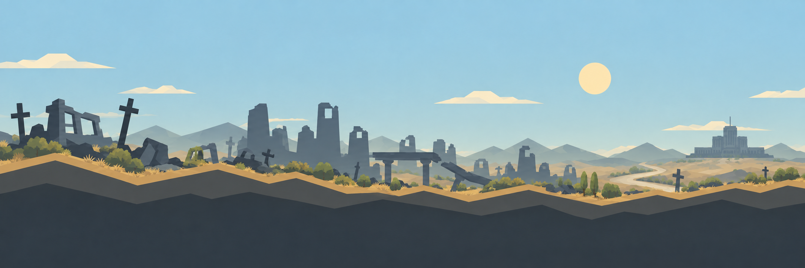

# Панорамы, время суток и погода

[Открыть просмотрщик сочетаний](art/panoramas/preview.html) · [Пространственная схема мира](Пространственная схема мира.md) · [Визуальный стиль](Визуальный стиль и музыка.md)

Панорама — **дальний план над игровой поверхностью**. Вход в бункер, дорога, наземные постройки, герои и их тени находятся ближе к камере и не нарисованы на фоне. Один и тот же силуэт разрушенного города и правительственного комплекса сохраняется между состояниями, чтобы смена сезона не выглядела сменой местности.

## Базовые состояния

| Сезон | День | Ночь | Отличия |
| --- | --- | --- | --- |
| Весна | [PNG](art/panoramas/spring-day.png) | [PNG](art/panoramas/spring-night.png) | Остатки снега, талая вода, первые побеги |
| Лето | [PNG](art/panoramas/summer-day.png) | [PNG](art/panoramas/summer-night.png) | Сухая трава, кусты, ясное небо |
| Осень | [PNG](art/panoramas/autumn-day.png) | [PNG](art/panoramas/autumn-night.png) | Охра, редкие листья, холодный свет |
| Зима | [PNG](art/panoramas/winter-day.png) | [PNG](art/panoramas/winter-night.png) | Снежные пласты, лёд и голые деревья |

Ночные версии сохраняют сезонные признаки. Между днём и ночью в игре нужен плавный переход света и цвета; восемь PNG задают крайние художественные состояния. Солнце, луна, окна дальнего комплекса и свет у входа управляются отдельными слоями.

## Движение солнца и игровые сутки

**24 игровых часа проходят за 24 реальные минуты при скорости 1×.** Одна реальная минута равна одному игровому часу. Солнце движется по небу дальнего плана слева направо над руинами **между рассветом и закатом, время которых зависит от сезона**. Для прототипа берём такие ориентиры в середине каждого сезона:

| Сезон | Рассвет | Закат | Световой день при 1× |
| --- | ---: | ---: | ---: |
| Весна | 06:00 | 18:00 | 12 реальных минут |
| Лето | 04:00 | 20:00 | 16 реальных минут |
| Осень | 07:00 | 17:00 | 10 реальных минут |
| Зима | 09:00 | 15:00 | 6 реальных минут |

Это рабочие значения для художественного климата игры. Между серединами сезонов часы рассвета и заката **плавно меняются каждый игровой день**, включая переход зима → весна; скачка света при смене названия сезона нет. Полдень пока остаётся около 12:00, но высота дуги солнца тоже зависит от сезона: летом выше, зимой ниже. Общая длительность суток остаётся 24 реальными минутами при 1×; изменяется только соотношение света и темноты.

Положение солнца, яркость неба, цвет освещения поверхности, длина и направление теней вычисляются из **сохранённых игрового времени и даты сезона**. На рассвете и закате свет меняется плавно; в сумерках появляется свет окон и входа. В ночной части цикла солнце скрыто, а луна и звёзды при ясной погоде могут двигаться отдельным слоем. Облака, туман и осадки могут закрыть светило, но не сдвигают часы рассвета и заката. На паузе движение останавливается, после загрузки продолжается с той же даты и часа. Ускорение игры позднее ускорит и видимое движение.

Солнце и луна не должны быть нарисованы в готовом игровом фоне: иначе появится неподвижный второй диск. Нынешние PNG с уже нарисованными светилами остаются цветовыми и композиционными образцами. Для игровых ресурсов небо и небесные тела нужно разделить; погодный слой «Палящее солнце» должен добавлять жару и марево вокруг текущего положения солнца, а не рисовать ещё одно светило.

## Погодные слои

Погода накладывается **поверх выбранного сезонного и суточного фона**. Прозрачные SVG из [`art/panoramas/weather/`](art/panoramas/weather/) служат визуальными эскизами слоёв; их [генератор](art/panoramas/weather-overlay-generator.js) позволяет менять плотность и палитру. В игре осадки, ветер, вода и молнии должны анимироваться, а их состояние вычисляет симуляция. Погода влияет на доступность наземной стройки, экспедиции, растения и сети лишь через отдельные игровые правила, а не через цвет картинки.

| Явление | Файл слоя | Читаемый признак | Потенциальное влияние на игру |
| --- | --- | --- | --- |
| Туман | [fog.svg](art/panoramas/weather/fog.svg) | Светлые горизонтальные полосы, потеря контраста вдали | Хуже обзор и разведка |
| Дождь | [rain.svg](art/panoramas/weather/rain.svg) | Редкие наклонные струи и влажный воздух | Мокрая почва, открытые работы медленнее |
| Кислотный дождь | [acid-rain.svg](art/panoramas/weather/acid-rain.svg) | Сдержанный зелёный оттенок осадков | Защита жителей, фильтры и износ открытого оборудования |
| Палящее солнце | [scorching-sun.svg](art/panoramas/weather/scorching-sun.svg) | Тёплая плоская засветка и марево | Жара, расход воды, нагрузка на охлаждение |
| Вьюга | [blizzard.svg](art/panoramas/weather/blizzard.svg) | Плотный снег почти горизонтально | Опасный выход, заносы, обледенение |
| Гроза | [thunderstorm.svg](art/panoramas/weather/thunderstorm.svg) | Тёмное небо, дождь и короткая молния | Риск для линий и наземных объектов |
| Ураган | [hurricane.svg](art/panoramas/weather/hurricane.svg) | Широкие потоки ветра и наклонные частицы | Ветровая нагрузка на постройки и маршруты |
| Ливень | [downpour.svg](art/panoramas/weather/downpour.svg) | Очень густой дождь | Переполнение стоков, затопление низин |
| Смерч | [tornado.svg](art/panoramas/weather/tornado.svg) | Один локальный вращающийся столб | Траектория разрушений на поверхности |
| Наводнение | [flood.svg](art/panoramas/weather/flood.svg) | Видимый подъём воды у земли | Закрытые проходы, насосы и гидроизоляция |
| Снегопад | [snowfall.svg](art/panoramas/weather/snowfall.svg) | Спокойно падающие снежинки | Постепенное накопление снега |
| Град | [hail.svg](art/panoramas/weather/hail.svg) | Короткие светлые удары | Повреждение теплиц и людей снаружи |
| Пыльная буря | [dust-storm.svg](art/panoramas/weather/dust-storm.svg) | Охристая завеса и песчаные полосы | Фильтры, видимость, загрязнение техники |
| Пеплопад | [ashfall.svg](art/panoramas/weather/ashfall.svg) | Тёмная пелена и медленные частицы | Очистка воздуха и воды |

Туман, дождь, ливень, гроза и наводнение могут следовать друг за другом в одном погодном событии. Снегопад может перейти во вьюгу. Кислотный дождь — редкое явление заражённых территорий, а не обычная разновидность летнего дождя. Для смерча и наводнения нужен локальный объект опасности на игровой поверхности; одного фонового слоя недостаточно. Пыльная буря и пеплопад добавлены к исходному перечню как примеры других явлений.

## Сочетания и приоритеты

Сезон, часы суток и погода хранятся как разные состояния, но сезон определяет рассвет, закат и допустимые погодные условия. Палящее солнце возможно главным образом летом и в жаркой зоне, вьюга — зимой или в холодном биоме. В просмотрщике ограничения сняты, чтобы художник мог сравнить слои.

В один момент работает **одно основное погодное состояние**. Небольшие сопутствующие эффекты, например туман после ливня, могут иметь отдельную интенсивность. При смене погоды сначала меняется общий свет и дальняя видимость, затем появляются частицы и следы на земле. Важное сообщение о риске остаётся читаемым при любом фоне и не передаётся только цветом. Звуковые состояния синхронизируются с [звуковым дизайном](Звуковой дизайн.md).

## Что является концептом, а что игровым ресурсом

Восемь сезонных PNG и прозрачные погодные SVG — **арт-прототипы**. Для игры их нужно разделить на слои неба без нарисованного солнца и луны, дальних гор, города и ближних руин, проверить стык с наземной стройкой и скорость параллакса. Время суток плавно меняет освещение и цвет, используя PNG как ориентиры; положение светил вычисляется отдельно. Осадки и ветер должны двигаться, а наводнение, сугробы и повреждения — оставаться в мире после прекращения явления, если это предписывают правила симуляции. Состояния погоды и время переходов сохраняются вместе с миром.
