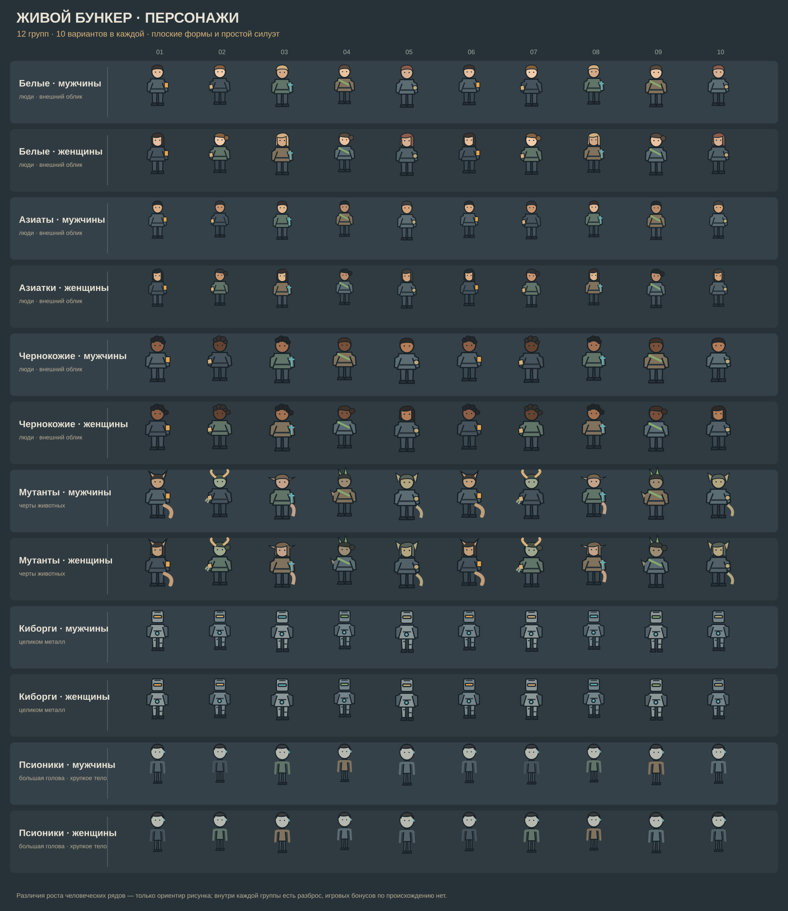
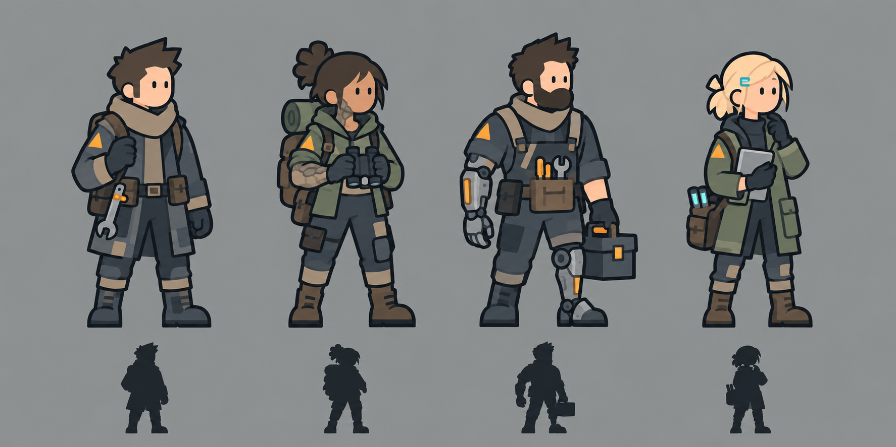

# Концепция персонажей «Живого бункера»

Персонаж здесь — человек с работой, потребностями и памятью о прожитом. Игрок узнаёт его по поступкам: кто расчистил первую комнату, кто починил лифт, кто вернулся из пустоши раненым. Системы развития должны поддерживать эти истории, а не превращать жителей в одинаковые множители производства.

Документ развивает [общую идею](Идея.md), [первый игровой час](Первый игровой час.md) и фирменный стиль [«Слоистый свет»](Визуальный стиль и музыка.md).

## 1. Из чего складывается персонаж

| Слой | Что определяет | Может ли меняться |
| --- | --- | --- |
| Личность и биография | Имя, возраст, происхождение, связи, несколько памятных событий | Биография пополняется; прошлое не переписывается |
| Характер | Склонность к риску, общению, порядку, заботе, самостоятельности | Медленно меняется под влиянием опыта |
| Навыки | Что человек умеет делать на практике | Растут через работу, обучение и наставничество |
| Профессия | Основная роль и привычный набор задач | Можно переучиться и совмещать роли |
| Направление развития | Человек без модификаций, мутации, импланты, псионические способности и их сочетания | Открывается постепенно; изменение требует условий и имеет последствия |
| Состояние | Здоровье, травмы, силы, голод, жажда, сон, гигиена, стресс и мораль | Постоянно меняется |
| Оснащение | Одежда, инструмент, оружие, протез, расходники | Можно менять, ремонтировать и улучшать |

Травмы имеют тип, тяжесть и видимый дебафф к работе, движению или бою. Лёгкий ушиб из пролога проходит после сна; тяжёлые травмы требуют препарата или медицинской помощи и отдыха. [Таблица травм и лечения](Этапы/02-GDD/Травмы%20и%20лечение.md) задаёт первые игровые состояния и черновые значения.

**Мощь для экспедиций** — сводный показатель готовности персонажа к опасному заданию. Основу дают амуниция и активный комплект оружия; навыки, здоровье, состояние вещей и применимые гаджеты меняют итог. У отряда проверяются отдельно число участников и совокупная мощь. Порог ключевой миссии показывается до отправки, а точную формулу и баланс задаёт GDD боя.

Слоты амуниции: головной убор, тело, штаны, ботинки, перчатки, левая рука, правая рука, двуручное оружие и два аксессуара-гаджета. Персонаж может одновременно иметь предметы в обеих руках и двуручное оружие в отдельном слоте для переключения. Во время действия активен один комплект: левая и правая руки **или** двуручное оружие. Неактивное оружие не прибавляет урон к текущей атаке; его вес и износ учитываются отдельно.

Каждая надетая вещь имеет [износ от 0% до 100%](Этапы/02-GDD/Износ,%20ремонт%20и%20склад.md). Её вклад в броню, урон, гаджет или мощь отряда падает вместе с оставшейся эффективностью; улучшение и заточка не заменяют ремонт. При 100% износа предмет остаётся у персонажа, но не даёт эффекта, пока его не починят за **запчасти**. Разборка на запчасти возможна только отдельным ручным приказом после снятия вещи.

**Профессия не запирает действия.** Медик может помогать на стройке, а строитель — учиться лечению. Без подготовки работа идёт медленнее и с большим риском ошибки. **Направление развития не равно профессии:** киборг может быть врачом, мутант — инженером, псионик — разведчиком. Пол и реальное происхождение человека не дают скрытых игровых бонусов или штрафов.

## 2. Главный герой

В начале игры герой возвращается с экспедиции в действующий двухуровневый бункер и проходит задания Светы. После нападения он возвращается к руинам один. Он достаточно универсален, чтобы взломать вход, открыть ящик, расчистить завал, починить кровать, построить очаг и перевязать рану. Игрок с первых минут видит его движение и состояние в мире, а не только аватар в меню. Начальная внешность и имя могут выбираться игроком; выбор не ломает обязательную цепочку первого часа.

Герой **не умирает окончательно**, но может проиграть бой, получить тяжёлую травму, попасть в плен и потерять время, вещи или доступ к части планов. Возвращение к игре должно быть объяснено сценарием конкретного поражения: спасение, побег, обмен или восстановление в безопасном месте. Бессмертие не защищает его от последствий и не делает всесильным.

В эндгейме герой может подключиться к центральной системе правительственного комплекса и стать **ядром главного бункера**. Подключение необходимо для полной активации комплекса и необратимо в рамках кампании: герой больше не путешествует между базами. Ручное управление остаётся в главном бункере; другие убежища работают по подготовленным автономным правилам. До этого шага игроку нужно закончить личные поездки и настроить снабжение сети.

До подключения к ядру игрок может развивать героя как мастера, исследователя, бойца, руководителя или универсала. Он способен лично участвовать в доступной работе текущего бункера и освоить все четыре направления развития, если готов вложить время и поддерживать соответствующее оснащение. Путь одиночки остаётся возможным: автоматизация, торговля и редкие технологии компенсируют отсутствие жителей лишь частично. Большой город без жителей герой не строит с той же скоростью, что коллектив.

## 3. Жители и управление ими

Каждый житель сохраняет индивидуальность, но игрок не обязан раздавать ему каждое мелкое поручение. По мере роста убежища открываются четыре масштаба управления:

1. **Личное действие героя:** в одиночку исследовать, ремонтировать, добывать, строить и лечиться.
2. **Поручения небольшой общине:** назначать конкретных жителей на ремонт, лечение, обучение, комнату или экспедицию; задавать личный график и приоритеты.
3. **Рабочие группы:** указать бригаде профессию, смену, зону и цель; планировщик распределяет доступные задачи между её участниками.
4. **Правила большого поселения:** задать районные цели вроде запаса воды, производственной нормы или ремонта аварий; управляющие, группы и жители разбивают цель на работы.

Открывающий эпизод кратко показывает четвёртый масштаб, после гибели большого убежища игрок начинает с первого и постепенно проходит остальные. На любой ступени можно открыть карточку конкретного человека и дать ему личное поручение.

Персонаж выбирает задачу с учётом навыка, инструмента, доступного пути, срочности, собственного состояния и риска. Игрок видит причину простоя: «нет кабеля», «устал», «нет доступа к этажу», «не хватает допуска к оборудованию». Опасное поручение можно запретить для неподготовленных, а срочное спасение — разрешить добровольцам. Приоритеты не отменяют потребность во сне, воде и лечении.

### Суточный график и смены

У каждого взрослого жителя есть **расписание на 24 игровых часа**. Игрок размечает день часовыми ячейками или протягивает длинные блоки: сон, работа в выбранной комнате, универсальная работа, обучение, свободное время и резерв на личные потребности. Готовые шаблоны «дневная смена», «вечерняя смена», «ночная смена» и «гибкий график» можно назначить одному человеку, профессии или группе, затем поправить индивидуально. Один игровой день длится 24 реальные минуты при скорости 1×; один час расписания соответствует одной реальной минуте. На паузе график не движется, после загрузки продолжается с сохранённого игрового времени.

Рабочий блок можно привязать к **конкретной комнате и её функции**: например, кухня — приготовление пищи, мастерская — выпуск деталей, медпункт — приём пациентов. В пределах блока житель берёт доступные заказы этой комнаты с учётом навыка, допуска, инструмента и приоритета производства. Если заказов нет, он может перейти к разрешённым универсальным задачам либо получить объяснимый простой. В карточке комнаты задаются потребность в работниках по сменам, предел одновременных рабочих мест и приоритет заказов; расписание людей показывает, закрыты ли эти смены.

Расписание задаёт **намерение**, а не мгновенную выработку. Переход между комнатами, доставка материалов, еда и лечение занимают время. Производство идёт лишь при наличии работника на месте, исправного оснащения, ресурсов и нужных сетей; автоматизированная функция отдельно указывает, сколько она способна делать без людей. Один человек не может одновременно обслуживать две комнаты. Если он заболел, ушёл в экспедицию или получил срочный приказ, назначение временно освобождается, а незавершённая работа сохраняется для следующей смены.

Сон, еда и восстановление остаются обязательными потребностями. Интерфейс предупреждает о нехватке отдыха, непрерывной ночной работе и невозможном переходе между сменами; перегрузка ведёт к усталости, ошибкам и ухудшению здоровья. При угрозе пожара, нападения или тяжёлой травме аварийные правила могут временно прервать график и показать причину. Главный герой в прологе действует по прямым командам игрока; позднее для него можно включить добровольный график, который прямой приказ временно отменяет.

Первый рабочий пример: два жителя закрывают кухню с 06:00 до 14:00 и с 14:00 до 22:00, а с 22:00 до 06:00 она не производит еду. Если поставить третьего на этот промежуток и обеспечить каждому отдельный сон, кухня сможет работать круглые сутки, пока хватает топлива, воды и сырья. Расписание задаётся по игровым часам и не сдвигается вслед за сезонным рассветом; часть смены может проходить в темноте и требовать освещения. Игрок видит на шкале комнаты незакрытые часы и ожидаемую выработку, а на шкале жителя — работу, путь, отдых и причину отклонения от плана.

Жители приходят из экспедиций, торговли, спасательных событий и других поселений. Вербовка зависит от условий жизни и доверия. Пленные имеют отдельное состояние и собственные мотивы; их нельзя мгновенно превратить в лояльного работника. Семьи, дети, старение, смерть и династии добавляются после устойчивой системы взрослых жителей и удовлетворения базовых потребностей. История умершего остаётся в памяти людей и летописи поселения.

На ступени рабочих групп житель получает личный баланс фантиков. При денежном строе он получает зарплату за работу, платит за товары и услуги и участвует в налоговой системе. При общем строе деньги не используются для повседневного распределения, но личная история труда, потребностей и прежних накоплений не должна исчезать без явного правила перехода. Подробности — в [экономике и законах](Этапы/02-GDD/Экономика%20и%20законы.md).

## 4. Профессии и навыки

Профессия — удобный набор приоритетов и стартовой подготовки. Навык — реальная способность выполнить конкретную работу. Основные группы:

| Группа | Примеры работ | Что улучшает мастерство |
| --- | --- | --- |
| Стройка | Расчистка, кладка, опоры, перепланировка | Скорость, безопасность, качество конструкции |
| Инженерия и электрика | Сети, лифт, станки, автоматизация | Надёжность, эффективность, допуск к сложному оборудованию |
| Ремесло и производство | Инструменты, детали, одежда, оружие | Выход годных изделий, качество, бережный расход |
| Медицина и уход | Перевязка, лечение, санитария | Скорость помощи, риск осложнений, восстановление |
| Разведка и выживание | Маршруты, опасности, добыча, перенос груза | Точность оценки риска, полезная добыча, безопасность пути |
| Связь и доступ | Терминалы, замки, довоенные системы | Время взлома, доступные способы и сохранность содержимого |
| Управление и общение | Планирование смен, наставничество, переговоры | Координация группы, передача знаний, разрешение конфликтов |
| Бой и охрана | Оборона, оружие, тактические приказы | Выживаемость, дисциплина, точность действий |

Мастерство растёт прежде всего от осмысленной практики, а сложные приёмы требуют обучения, чертежа или наставника. Повторение самой простой операции не должно бесконечно растить высокоуровневый навык. Навык влияет на **время**, **риск**, **качество результата** и **работу с оборудованием**. Сложный станок или комната требуют подготовки; если доступ ограничен квалификацией, игрок видит, чему именно нужно научиться и где получить знания. Старые комнаты можно улучшить позднее более опытной бригадой.

**Инструмент усиливает умение.** Хороший мультитул ускоряет опытного инженера; новичку он помогает лишь частично. Плохой инструмент не лишает мастера знаний, но ограничивает скорость и качество. Для стройки отдельно важны мастерство человека, состояние инструмента, уровень проекта и доступность материалов. Специализированная комната даёт бонус функции до установленного в [концепции](Идея.md) предела; она не повышает все навыки человека разом.

### Базовые параметры и стартовые профили

У персонажа четыре базовых параметра: **сила** влияет на переноску и тяжёлую работу, **выносливость** — на запас сил и переносимость нагрузок, **интеллект** — на скорость освоения сложных задач и анализ, **ловкость** — на точные движения и манёвры. Это параметры игры, которые могут расти; конкретное умение по-прежнему определяется навыком. Предварительная шкала: обычный стартовый человек имеет **5/5/5/5**. Обозначения означают **процент от базового значения параметра**: `+` = +30%, `++` = +50%, `−` = −30%, `−−` = −50%. Например, при базе 5 один плюс даёт 6,5, два плюса — 7,5, один минус — 3,5, два минуса — 2,5.

Если действуют подготовка и направление развития, их множители применяются последовательно к текущему базовому значению: например, интеллект 5 с `+` от подготовки и `++` от киборгизации равен `5 × 1,30 × 1,50 = 9,75`. Несколько направлений также перемножаются; стоимость их сочетания описана ниже. Во внутренних расчётах сохраняется дробное значение, в интерфейсе показывается один знак после запятой. Итоговый параметр не опускается ниже 1. Эта формула пока рабочая и должна пройти проверку баланса.

Белые, азиатские и чернокожие персонажи начинают с **одинаковой базы 5/5/5/5**. Внешность и рост на арт-листе не задают интеллект, силу или другие игровые свойства. Нужные сочетания плюсов и минусов выбираются как **подготовка**, доступная человеку любого происхождения:

| Подготовка человека | Сила | Выносливость | Интеллект | Ловкость | Пример роли |
| --- | ---: | ---: | ---: | ---: | --- |
| Без специализации | 0 | 0 | 0 | 0 | Универсальный герой |
| Техник-разведчик | −30% | 0 | +30% | +30% | Взлом, разведка, тонкая работа |
| Тяжёлый строитель | +30% | +30% | −30% | 0 | Переноска, расчистка, укрепление |

Минусы подготовки обозначают **распределение стартовой практики**, а не врождённую неспособность. Обучение и смена профессии позволяют развить любую сторону. Профиль не заменяет навыки: сильный новичок не построит качественный лифт без инженерной подготовки.

Направления развития дают отдельные модификаторы после открытия соответствующей технологии или способности:

| Направление | Сила | Выносливость | Интеллект | Ловкость | Цена преимущества |
| --- | ---: | ---: | ---: | ---: | --- |
| Мутант | +50% | +50% | −50% | 0 | Особые потребности, нестабильность изменений и лечение |
| Киборг | +50% | 0 | +50% | −50% | Энергия, запчасти и обслуживание полного механического тела |
| Псионик | −50% | 0 | +50% | +50% | Утомление, долгий контроль и психическая нагрузка |

Это **рабочие процентные модификаторы**, а не окончательный баланс. Сочетание направлений возможно, но требует обеспечения и не даёт бесплатного сложения всех преимуществ. Физические изменения показываются на том же персонаже; история, навыки и отношения сохраняются.

### Общие бонусы бункера

Число членов поселения даёт один общий бонус ко всем четырём **эффективным** параметрам каждого жителя. Считаются герой и постоянные взрослые жители, даже если они ранены или временно ушли в экспедицию; гости, дети и несамостоятельные промышленные роботы в счёт не входят. Это не позволяет включать «Одиночку», просто отправив остальных за дверь.

| Постоянных персонажей | Название | Бонус ко всем параметрам |
| ---: | --- | ---: |
| 1 | Одиночка | +100% |
| 2 | Дуэт | +50% |
| 3 | Триада | +25% |
| 4 | Квартет | +10% |
| 5 и более | Бонус размера отсутствует | 0; доступны бонусы населения |

При пяти и более жителях открывается **общая программа подготовки и согласования работы**. После её проведения поселение получает +100% ко всем параметрам вместо бонуса размера. Программа доступна смешанному составу и людям любой внешности. Если все постоянные жители принадлежат одному вымышленному направлению, эффект может получить тематическое название: **«Зоопарк»** для мутантов, **«Биииип»** для полностью механических персонажей, **«Зуммзаа»** для псиоников. У смешанного состава название **«Слаженная община»**. Название меняет подачу, а не величину эффекта; одновременно действует только один бонус населения. Несамостоятельные роботы не становятся жителями ради активации «Биииип».

После общей подготовки поселение может развить две дополнительные программы, доступные **любому составу жителей независимо от пола**:

| Рабочее название | Условие | Бонус ко всем параметрам |
| --- | --- | ---: |
| «Сосисочная» | Работающая общая кухня и регулярная совместная трапеза | +125% (множитель 2,25) |
| «Вумен повер!» | Клуб взаимопомощи и наставничества с помещением и участниками | +175% (множитель 2,75) |

Названия отражают юмор и традиции конкретной общины, а не ограничения на участие. Для бонуса нужен действующий порядок работы, поэтому при остановке кухни или распаде клуба эффект пропадает. Если доступны несколько программ населения, применяется **самый высокий один** бонус; их проценты не складываются.

**«Каждой твари по паре»** — особый бонус разнообразия: если среди как минимум пяти постоянных взрослых жителей есть четыре **разных персонажа**, представляющих все игровые направления — человека без модификаций, мутанта, полностью механического персонажа и псионика, — каждый житель получает **+250% ко всем четырём параметрам**. Достаточно одного представителя каждого направления; пятый и последующие могут быть любыми. Персонаж с несколькими направлениями занимает только один слот по выбранному основному направлению. Бонус включается при выполнении условия и заменяет любой другой бонус населения: эффекты не складываются. В формуле +250% означает множитель **3,50**; например, базовая сила 5 без других модификаторов станет 17,5.

Реальная этническая внешность и пол не являются условием бонуса. Так одинаковая по силе община может состоять из разных людей, а игрок выбирает жителей за навыки, характер и историю. Если у персонажа база силы 5, личный модификатор `+` и бонус «Дуэт», итог равен `5 × 1,30 × 1,50 = 9,75`; с «Одиночкой» было бы `5 × 1,30 × 2,00 = 13`. Бонусы размера и населения не складываются. Проценты и требуемое время общей подготовки проверим на прототипе, особенно переход от четырёх к пяти жителям и силу бонуса разнообразия.

## 5. Четыре направления развития

Это направления вымышленной адаптации, а не оценка людей по реальной «расе». Все четыре могут дать сильного персонажа; преимущество всегда связано с ценой и условиями.

| Направление | Отличие в игре | Обслуживание и риск | Признак в силуэте |
| --- | --- | --- | --- |
| Человек без модификаций | Гибкое обучение, медицина, командная работа, дипломатия | Сильнее зависит от снаряжения и подготовленной среды | Одежда, инструменты и нашивки профессии |
| Мутант | Адаптация к тяжёлой среде, устойчивость или особое чувство | Нестабильность отдельных изменений, лечение, особые потребности | Один-два заметных биологических признака без образа чудовища |
| Киборг | Точная и тяжёлая работа, встроенное устройство или протез | Питание, запчасти, настройка, риск отказа | Видимый функциональный имплант, иной контур конечности |
| Псионик | Предчувствие угрозы, поиск, поддержка группы, редкие способы взаимодействия | Утомление, обучение, контроль психического состояния | Сдержанный знак способности и особая поза, без постоянного магического свечения |

Сочетания доступны, но две мощные адаптации не складываются в бесплатный набор бонусов: возникают требования к энергии, здоровью, стабильности и обучению. У обычных жителей специализация может быть глубже, чем у героя-универсала, за счёт жизненного опыта и командной работы. Мутации и псионические проявления не назначаются как наказание за внешность персонажа; их игровые эффекты и риски сообщаются явно.

## 6. Биомы, состояние и работа

Биом действует на задачу и условия вокруг персонажа. Мутант-разведчик может лучше переносить заражённую зону, человек-земледелец — выращивать пищу на восстановленной земле, киборг-инженер — обслуживать промышленную инфраструктуру, псионик — раньше обнаруживать опасность на маршруте. Это **сочетание навыка, оборудования и среды**, а не постоянный бонус всему типу персонажа. У подходящего биома бывают издержки для других жителей; терраформинг меняет состав задач и потребностей поселения.

Потребности влияют на поведение постепенно и объяснимо. Сон и питание снижают ошибки; чистота и вода важны для здоровья; стресс и отношения влияют на готовность помогать и рисковать. Игрок получает предупреждение и способ исправить ситуацию до тяжёлого последствия. Для большого города подробное состояние каждого человека хранится, но интерфейс сводит проблемы по районам и группам, позволяя открыть историю конкретного жителя.

Травма состоит из причины, тяжести и осложнений. После поражения житель обычно оказывается выведенным из строя; затем важны эвакуация, перевязка, отдых и лечение. Инвалидность или потеря конечности могут открыть путь к протезированию, но не обнуляют прежние навыки и отношения. Герой и жители могут вернуться к работе с ограничениями, которые понятны игроку.

## 7. Отношения, память и события

У жителя есть несколько значимых связей: семья, друзья, наставник, соперник, спасённый человек. События пополняют короткую личную хронику: «вскрыл вход», «построила первый водосбор», «пережил обвал», «спасла инженера». Связи влияют на помощь, мораль, доверие и конфликты, но не должны требовать от игрока чтения сотен одинаковых уведомлений.

Для каждого жителя достаточно **одной видимой цели или заботы**, которая проявляется в работе и событиях: починить семейную вещь, освоить профессию, найти пропавшего, улучшить жильё. Игрок может поддержать цель или отложить её, получив понятные последствия. Характер задаёт предпочтение и реакцию, а не случайный отказ исполнять любой приказ.

## 8. Экспедиции и бой

Участник вылазки берёт снаряжение, еду, воду и груз; его навыки и состояние меняют сведения о маршруте и цену выбора в событии. Разведчик полезен ещё до боя: замечает опасность, выбирает обход и уточняет прогноз. После возвращения груз нужно разгрузить, а раненого лечить. Если он не вернулся, игрок получает следы и возможность спасательной экспедиции, когда это допускает событие.

В бою персонажи действуют по подготовке, оснащению, характеру, командиру и выбранной доктрине. Игрок может вмешаться отдельным приказом. Сильный боец остаётся уязвимым к истощению, плохой позиции и серьёзной травме. Большая армия требует снабжения и медиков; для героя-одиночки сохраняются разведка, скрытность, переговоры и отступление.

При тревоге охранники идут к назначенному рубежу с учётом своего местоположения и пути: сначала наружная оборона, затем [боевой коридор](Оборона бункера.md) или заранее выбранная позиция ниже. Мирные жители уходят за защищённые двери, эвакуируют раненых или помогают снабжением. Переход на следующий этаж занимает время; защитники не появляются там мгновенно по смене фазы.

## 9. Внешность в стиле «Слоистый свет»

Рост силуэта определяет анимацию прохода независимо от происхождения персонажа. Одна клетка равна 0,8 м: художественные ориентиры роста 2 / 2,5 / 3 клетки соответствуют 1,6 / 2 / 2,4 м. В коридоре с чистой высотой 4 клетки (3,2 м) все стартовые персонажи идут в полный рост. Если рост больше 2,5 клетки — свободной высоты двери 2 м, — персонаж пригибается при входе и распрямляется сразу за порогом. Это относится и к крупным киборгам или индивидуальным высоким вариантам; проверка использует фактический габарит тела и снаряжения.

**Новый ориентир упрощения:** двенадцать рядов по десять вариантов: белые мужчины и женщины, мужчины и женщины восточноазиатской внешности, чернокожие мужчины и женщины, мутанты, киборги и псионики обоих полов. Внутри каждого ряда различаются одежда, волосы, оттенки кожи, снаряжение, телосложение и отдельные признаки. Для [масштабного макета первого уровня](Первый наземный уровень.md) базовый светлокожий силуэт имеет высоту 2,5 кубика, восточноазиатский и псионик — 2, темнокожий и мутант — 3. Индивидуальные варианты могут перекрываться по росту; эти числа задают художественную разницу данного набора, а не игровой бонус по происхождению. Высота киборга зависит от исходного тела и модификаций. Для киборгов показано полностью механическое тело; для мутантов — разные животные черты; для псиоников — крупная голова относительно хрупкого тела.

Лист сделан как редактируемый векторный набросок, а не готовые спрайты. Его [генератор](art/concepts/character-roster-120.js) позволяет менять пропорции и палитру целыми рядами. Следующая проверка — выбрать несколько фигур из разных рядов и посмотреть, читаются ли они в настоящем размере на фоне комнат.

Предыдущий лист показывает четыре **варианта развития**, а не обязательные классы или фиксированную внешность. Он остаётся ориентиром по инструментам и деталям костюмов; степень упрощения задаёт новый обзор. В игровом наборе нужны разные фигуры, причёски, возрастные признаки, одежда и инструменты внутри каждого направления; имплант или мутация появляются на прежнем персонаже, не заменяя его новым архетипом.

Фигура примерно четыре головы в высоту, лицо состоит из нескольких простых черт. На обычном масштабе читаются **поза, профессия, одна личная деталь и состояние**. Цвет одежды указывает на роль лишь как дополнительная подсказка; инструмент, форма сумки, защитный элемент или медицинская повязка должны работать и без цвета. Треугольная заплата связывает людей с фирменным мотивом ремонта, но не обязана быть на каждом костюме.

Набор базовых тел и одежды собирается из модульных частей, чтобы жители отличались друг от друга без сотен уникальных рисунков. Важные перемены остаются на том же персонаже: появился протез, сменился инструмент, добавилась повязка, вырос профессиональный знак. Анимации короткие и функциональные: идти, нести, работать, отдыхать, лечить, получать удар, спускаться по лестнице и пользоваться лифтом. Издали сложная анимация заменяется ясной позой и значком задачи.

## 10. Кого показываем в первую очередь

| Этап | Персонажи | Проверка |
| --- | --- | --- |
| Первый игровой час | Один герой, простая внешность, движение, работа, усталость и травма | Игрок узнаёт героя в разрезе и понимает, что тот делает без постоянного открытия карточки |
| Первые жители | 3–5 взрослых с разными навыками и одной личной чертой | Задачи распределяются понятно; у каждого остаётся различимая история |
| Развитие базы | Наставничество, профессии, отношения, медицинские и инженерные роли | Новые люди меняют возможности базы, а не только скорость производства |
| Долгая игра | Семьи, старение, поколения, четыре направления развития и их сочетания | Появляется история поселения и разные способы решать одну задачу |

**Открытые параметры для прототипа:** точные ступени навыков и темп обучения; тяжесть травм и время восстановления; число черт характера, которое остаётся понятным игроку; стоимость обслуживания имплантов и сложных мутаций; пороги автоматизации труда. Их следует калибровать на первом игровом часе и малом поселении, прежде чем расширять симуляцию до большого города.
