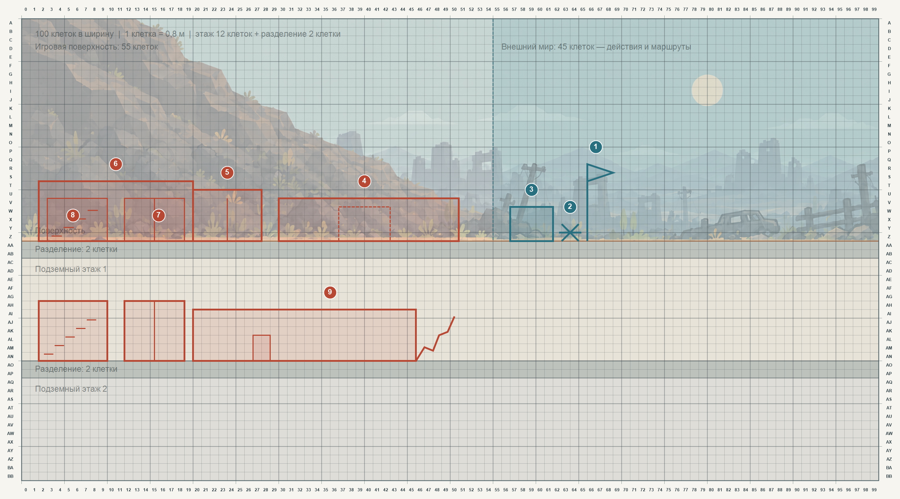

# Планировка первого экрана по эскизу

Эта схема переносит рисунок на сетку для обсуждения расположения. Координаты приблизительные: они фиксируют порядок объектов и ориентировочные границы, а не окончательные размеры художественных ассетов. Столбцы нумеруются с нуля, ряды обозначены буквами.

**Схема относится к разрушенному состоянию акта 1.** В прологе на той же поверхности находятся флагшток, КПП и вход, лифт и лестница работают; на первом подземном этаже коридор ведёт к действующим кладовке, бараку, кухне, столовой и штабу. Мастерскую игрок строит в прологе после расчистки участка коридора. После нападения лифт повреждён, часть коридора завалена, а уцелевшие комнаты восстанавливаются. Точные позиции дверей на сетке предстоит назначить отдельно.

| № | Объект | Ориентир на поверхности или под землёй |
| --- | --- | --- |
| 1 | Входной флаг | Поверхность, около `x = 66`, зона внешнего мира |
| 2 | Противотанковый ёж | Поверхность, около `x = 63…64`, перед КПП |
| 3 | КПП | Поверхность, около `x = 57…61`, зона внешнего мира |
| 4 | Руины дома | Поверхность, около `x = 30…50`; после ремонта здесь появится место для **средней комнаты** |
| 5 | Вход в бункер | Поверхность, около `x = 20…27`; проход ведёт влево во входную группу |
| 6 | Входная группа | Поверхность, около `x = 2…19`; объединяет подходы к лестнице и лифту |
| 7 | Лифт | Ось около `x = 12…18`; показан на поверхности и на первом подземном этаже |
| 8 | Лестница | Ось около `x = 3…9`; связывает входную группу с первым подземным этажом |
| 9 | Подземный коридор | От узла спуска около `x = 20` вправо до завала около `x = 46…50`; дверь маленькой комнаты около `x = 27…28` |

На поверхности `x = 0…54` остаются игровой территорией. Флаг, ёж и КПП расположены справа от этой границы — в зоне действий с внешним миром. Подземный этаж может продолжаться под обеими зонами. Между поверхностью и первым подземным этажом, как и между последующими этажами, проходит разделительный слой высотой 2 клетки.

Контур руин на рисунке шире механической средней комнаты: её проект по [правилам комнат](Комнаты и двери.md) занимает 6 клеток стены и 16 предметных мест. Пунктир внутри руин показывает только возможное место проекта; точку двери и способ восстановления дома следует определить при проработке этой постройки.

Коридор на первом подземном этаже заканчивается завалом. Маленькая комната существует за одной дверью размером 2 × 3 клетки; внутренние предметы на основном экране не расставляются вручную и на схеме не показываются.
