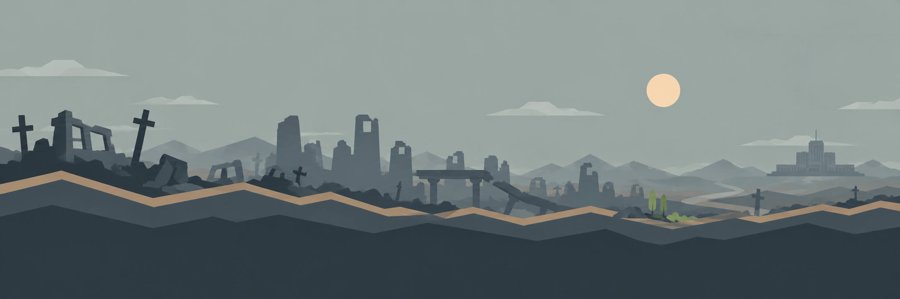
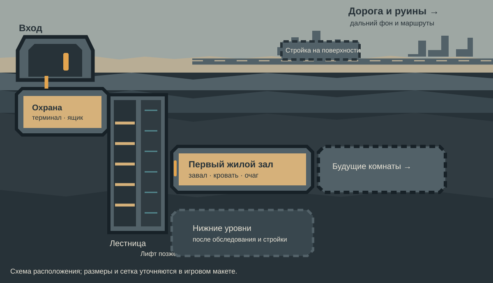

# Пространственная схема мира

Панорама задаёт дальний план над игровой поверхностью: слева близкие руины, дальше разрушенный город и дорога вправо, на горизонте едва заметный правительственный комплекс. Это цельный концепт дальнего фона; для движения камеры в игре его можно разделить на небо, дальние горы, город и ближние руины с разной скоростью параллакса. Строительный фон из [слоёв строительства](Слои строительства.md) — отдельная сетка плит за персонажами, а не часть этой панорамы. Наземные постройки, дорога под управлением игрока и персонажи рисуются поверх неё.

Варианты для четырёх сезонов, дня и ночи, а также погодные слои собраны в [панорамах и погоде](Панорамы и погода.md).

Точный масштаб первого участка показан в [разрезе наземного уровня 100 × 12 кубиков](Первый наземный уровень.md).

Текущее расположение объектов первого экрана по рисунку игрока перенесено в [планировку по эскизу](Планировка первого экрана по эскизу.md). Более ранние чертежи ниже остаются проверкой масштаба и ещё не отражают эту расстановку.

Для рисунка размещения объектов есть [обзорная сетка с координатами на 100 клеток](art/concepts/game-screen-layout-grid-coordinates.png) и [крупная сетка с координатами на первые 50 клеток](art/concepts/game-screen-layout-grid-large-coordinates.png). Число по горизонтали — столбец `x` от 0; буквы по вертикали — ряд от `A` до `BB`. Например, `AC39` означает ряд `AC`, столбец `39`. Каждый этаж занимает 12 рядов, а соседние этажи разделены конструктивным слоем высотой **2 клетки (1,6 м)**. Лестница, лифт и коммуникации пересекают этот слой в предусмотренных местах.

## Постоянная ориентация

- **Поверхность делится по горизонтали.** Клетки `x = 0…54` (55 клеток, 44 м) — игровая территория у бункера: здесь ходят персонажи, проходят нападения и размещаются наземные проекты. Вход находится около `x = 20…27`; входная группа с лестницей и лифтом лежит левее него, а правее стоят руины ремонтируемого дома. Правые `x = 55…99` (45 клеток, 36 м) — зона действий с внешним миром. На поверхности первого бункера видны флагшток, КПП и противотанковый ёж; КПП пока не имеет определённой игровой функции. Белый флаг обозначает PvE-режим одиночного выпуска, собственная эмблема и красный PvP-флаг предусмотрены концепцией будущей сетевой игры. Через правую зону выбирают маршруты, отправляют экспедиции и открывают события. Напрямую водить героя по её клеткам или строить там нельзя. Это ограничение относится только к поверхности: подземный этаж может использовать всю ширину 100 клеток.
- **На игровом участке над землёй можно строить.** Сначала доступны небольшой навес, склад или площадка у входа; позже — теплица, водосбор, мастерская, оборона, транспортная площадка и оборудование терраформинга. Для постройки нужны открытый участок, прочное основание, доступ, снабжение и защита от погоды или угроз. Поверхностные сооружения связаны с теми же запасами, жителями и сетями, что подземные.
- **Левее входа — первый узел.** За наружной гермодверью находится входная группа с лестницей и лифтом. **До нападения оба работают:** ускоряют движение людей и грузов между уровнями и тем самым повышают фактическое время работы. После взрыва лестница остаётся доступной, лифт повреждён и становится проектом ремонта. У входа сохраняются терминал и ящик для свободного восстановления в акте 1; место охранного поста предстоит уточнить. При нападении последовательность боевых зон: поверхность → входная группа → подземный коридор; см. [оборону бункера](Оборона бункера.md).
- **Единственный подземный этаж первого бункера.** В прологе здесь действуют кладовка, барак, кухня, столовая и штаб, соединённые коридором. После учебной расчистки игрок строит мастерскую. После нападения часть коридора завалена, комнаты разрушены; одна из них остаётся пригодной для первого восстановления кровати, готовки и воды. Игрок свободно выбирает дальнейший порядок работ. Глубокие этажи появятся в других убежищах и «Зоне 0»; первый бункер целиком состоит из поверхности и этого подземного этажа.

## Правило изображения и камеры

Это **одна связанная боковая сцена**, а не отдельные экраны «поверхность» и «бункер». Игрок может провести взглядом путь: дорога → вход → коридор с боковой охраной → лестница → жилой уровень. Колесо и перетаскивание камеры позволяют перейти от поверхности к глубине; команда возврата находит героя. При отдалении сохраняются ясные границы этажей, коридоров, шахты и наземных построек.

На поверхности дорога уходит вправо в зону внешнего мира. Для первого одиночного выпуска пустошь представлена маршрутами и событиями из [первого игрового часа](Первый игровой час.md); непрерывного ручного перемещения персонажа по правым 45 клеткам нет. Непосредственная зона вокруг входа остаётся игровой площадкой для строительства, труда и обороны. Дальний фон рисуется несколькими плоскими силуэтами в фирменном стиле «Слоистый свет».

## Стартовый кадр для прототипа

В обычном масштабе желательно видеть вход слева, кусок дороги и свободной поверхности справа, лестницу и лифт, а под ними — коридор и двери комнат. Для пролога нужны работающие состояния обоих путей и пяти подземных комнат; после нападения — разрушенные состояния тех же объектов. На далёком плане — немного руин без мелкой фактуры. Первый серый макет проверяет путь героя по этой схеме до производства финальных ассетов.
